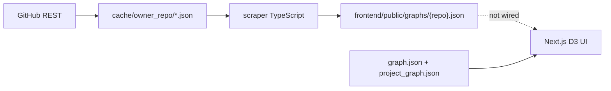
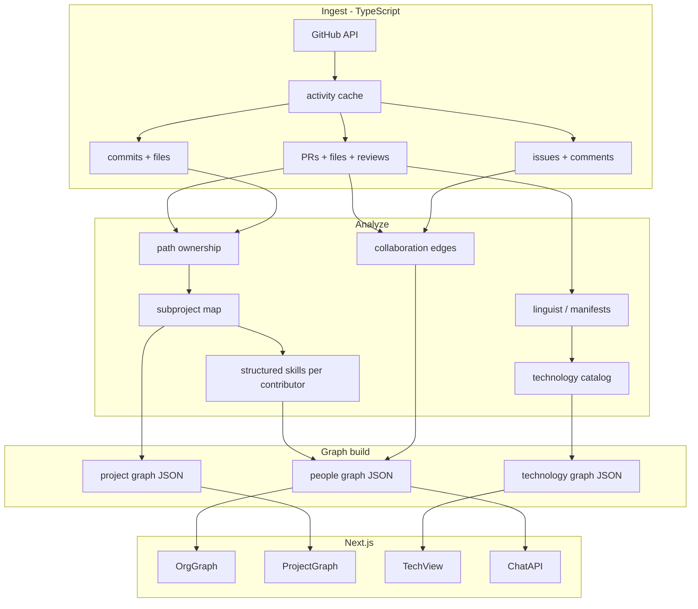

# Architectural decisions still needed

## Current state (committed vs working tree)

**Committed (`HEAD`)** has a working but narrow pipeline:

- **Scraper** ([`scraper/src/index.ts`](scraper/src/index.ts), [`github.ts`](scraper/src/github.ts), [`graph.ts`](scraper/src/graph.ts)): PRs + reviews + contributor stats (avatars only); file cache; Louvain communities; subsystems from labels/titles ([`subsystems.ts`](scraper/src/subsystems.ts)); expertise = PR-title keywords; edges = author↔reviewer.
- **Frontend** ([`frontend/app/components/OrgGraph.tsx`](frontend/app/components/OrgGraph.tsx)): still loads `/graph.json` and `/project_graph.json` (synthetic Slack org with LLM `skills_summary`, `work_summary`, rich `ProjectInfo`).
- **Docs** ([`CLAUDE.md`](CLAUDE.md), [`README.md`](README.md)): still describe Python + Slack + Leiden backend that no longer exists in the tree.
- **Working tree**: `frontend/` and most `cache/` are deleted locally; restore from git before building.

[`.cursor/research.md`](.cursor/research.md) defines the **target** (commits, issues, file analysis, structured skills, technology view). The scraper implements roughly **stage 1 (partial)** and **stage 3 (heuristic subset)** only.

---

## Decisions already implicitly made (confirm or revise)

| Area | Current choice | Risk if kept for “full” scope |
|------|----------------|------------------------------|
| Runtime | TypeScript monorepo (`scraper/` + `frontend/`) | Fine; drop Python unless you need `leidenalg`/heavy ML |
| GitHub access | REST via `@octokit/rest`, sequential review fetch | Rate limits hurt at scale; no issues/commits yet |
| Cache | Immutable JSON per repo under `cache/` | No TTL, no incremental sync, large repos blow disk |
| Subprojects | Label/title heuristics → `team` / `projects` | React/K8s often collapse to `"general"` (seen in sample graphs) |
| Skills | Unstructured keyword list in `expertise[]` | Conflicts with research “structured entities” |
| Communities | Louvain (`graphology-communities-louvain`) | Docs say Leiden; pick one and document why |
| Graph contract | Reuse Slack `Node` shape + optional `repo` on output | Project view + chat expect Slack-only fields |

---

## Open decisions (must decide before implementation)

### 1. Canonical data model and pipeline stages

Research describes four layers; you need an explicit **normalized activity schema** that all stages read/write, not ad-hoc `RawPR` → `GraphNode` in one step.

**Decide:**

- **Artifact layout** — e.g. `data/{owner_repo}/activity.json`, `structure.json`, `graph/people.json`, `graph/projects.json`, `graph/technologies.json`.
- **Entity IDs** — contributors (`login`), subprojects (slug), technologies (language/framework id), edges (typed: `reviewed`, `co_changed_file`, `co_owned_subproject`, etc.).
- **Versioning** — `schema_version` + `generated_at` on every output for frontend migration.

Without this, adding commits/issues later will force breaking changes to [`scraper/src/types.ts`](scraper/src/types.ts) and the UI.

### 2. Subproject / “project boundary” strategy (highest impact)

Research lists four signals; the scraper uses only two (labels, title prefixes). For large OSS repos, **label-only fails** (most nodes land in `general`).

**Decide primary + fallback ranking**, for example:

1. **Path ownership** — map changed files in PRs/commits to directory modules (`packages/react-reconciler/`, `src/vs/...`).
2. **Label/title** — keep current [`detectSubsystem`](scraper/src/subsystems.ts) as boost, not sole source.
3. **Dependency graph** — parse manifests (`package.json`, `go.mod`, `Cargo.toml`) for package nodes; optional for v1 if path-based works.
4. **Clustering** — contributor co-activity on paths when labels absent.

Also decide **merge rules** when signals disagree (weighted vote vs priority list).

### 3. Skill and technology representation

Research wants structured skills and a **technology view**; scraper uses string keywords; frontend has no technology graph.

**Decide:**

- **Skill taxonomy** — fixed enum (e.g. `rust`, `kubernetes`, `oauth`) vs free tags with normalization table vs ontology file per language ecosystem.
- **Inference sources** (ordered): file extensions / linguist → manifest deps → commit/PR text → optional LLM labeling on top-N contributors only.
- **Technology graph schema** — nodes: `Language`, `Framework`, `Tool`; edges: `used_in_subproject`, `touched_by_contributor`; whether technologies are first-class D3 view or filter lens on people/projects.

### 4. GitHub ingestion architecture

Full scope needs PR file lists, issues, comments, commits — not in [`github.ts`](scraper/src/github.ts) today.

**Decide:**

- **REST vs GraphQL** — GraphQL often better for batched PR files + issue threads; REST fine for MVP slices with heavy caching.
- **Incremental sync** — `since` cursor per resource, ETag/If-Modified-Since, append-only cache vs full refresh ([`WINDOW_MONTHS`](scraper/src/config.ts) is fixed window only).
- **Rate-limit policy** — token pool, backoff, prioritize PR metadata before per-commit walks on huge repos.
- **Bot/issue scope** — extend [`KNOWN_BOTS`](scraper/src/config.ts); whether issue authors without PR activity appear as nodes ([`CO_COMMENT_WEIGHT`](scraper/src/config.ts) is reserved but unused).

### 5. Analysis placement: heuristics vs LLM

Old Hop Onboard used multi-pass LLM for summaries; research allows metadata-only; scraper is heuristic-only.

**Decide per field:**

| Field | Heuristic | LLM (batch) |
|-------|-----------|-------------|
| `expertise` / skills | path + linguist + TF-IDF | optional enrichment |
| `skills_summary` / `work_summary` | omit or template | K2 pass on aggregated stats |
| Project `summary` / `display_name` | subsystem slug + keywords | optional for top subprojects |
| Chat answers | N/A | keep [`app/api/chat/route.ts`](frontend/app/api/chat/route.ts) grounded in graph JSON |

**Decide:** offline batch only (reproducible, cacheable) vs on-demand in API (cost/latency). Full metadata scope can stay **mostly non-LLM** with LLM as optional layer on computed profiles.

### 6. Graph computation and community detection

**Decide:**

- **Edge model** — multi-layer graph (reviews, co-review, shared subproject, co-changed path) with configurable weights vs single combined weight.
- **Community algorithm** — Louvain (already in deps) vs Leiden (needs `igraph`/`leidenalg` — Python sidecar or WASM); align with research “clustering” for subprojects vs “communities” for people teams.
- **Project graph builder** — port logic from removed `compute_project_graph.py`: subproject nodes, edges = shared contributors weighted by `min(weight_a, weight_b)`. Emit `project_graph.json` per repo in scraper, not only people JSON in `graphs/`.

### 7. Frontend integration architecture

Two parallel data worlds exist; full scope needs one **active dataset** per selected repo.

**Decide:**

- **Repo selector** — URL param (`?repo=facebook/react`) or header dropdown; load `graphs/{slug}.json` + matching `project_graph` + `technology_graph`.
- **Schema alignment** — either extend [`frontend/app/components/graph/types.ts`](frontend/app/components/graph/types.ts) for GitHub fields (`pr_count`, `avatar`, `repo`) and make Slack fields optional, or fork types behind a `source: "slack" | "github"` discriminator.
- **Project view** — map subproject slugs to `ProjectInfo` (synthetic `status: "active"`, `time_range` from window, `summary` heuristic or LLM); stop loading demo `project_graph.json` when GitHub repo selected.
- **Technology view** — new third tab ([research §4](.cursor/research.md)) vs defer; if included, new component + simulation hook mirroring [`useGraphSimulation.ts`](frontend/app/components/graph/useGraphSimulation.ts).
- **Chat** — point `loadPeopleContext()` at selected repo graph; include subproject + technology context in system prompt; filter highlights to current node set.
- **Styling** — replace hardcoded [`TEAM_COLORS`](frontend/app/components/graph/types.ts) (backend/frontend/design) with palette keyed by subsystem/community.

### 8. Operations, security, and repo hygiene

**Decide:**

- **What is committed** — `cache/` and large `graphs/*.json` in git vs `.gitignore` + CI artifact / download step (cache deletion in working tree suggests you may not want multi-MB JSON in repo).
- **Secrets** — `GITHUB_TOKEN` only in scraper/CI; `K2_API_KEY` only server-side for chat; never expose token to Next.js client.
- **Single entrypoint** — `npm run scrape` all repos vs `scrape --repo` + `npm run build:graphs` that produces all frontend assets.
- **Documentation** — rewrite [`CLAUDE.md`](CLAUDE.md) / [`README.md`](README.md) to GitHub pipeline (remove dead Python paths).

---

## Recommended target architecture (full metadata scope)

Aligns with your selected **full research.md** scope while reusing the existing UI shell:

**Suggested implementation order** (each step locks one decision):

1. Define normalized `activity.json` + `schema_version`; extend [`github.ts`](scraper/src/github.ts) (PR files, issues, commits) with incremental cache rules.
2. Implement path-based subprojects + merge with label/title; regenerate project graph artifact.
3. Add linguist/manifest technology detection + structured skills; emit `technology_graph.json`.
4. Wire frontend repo selector + dynamic fetch; adapt panels for GitHub fields; add technology view.
5. Optional LLM batch for summaries; reconnect chat to selected repo graph.
6. Update docs; policy for cache/graph artifacts in git.

---

## Summary

**Yes — many architectural decisions remain.** Research.md describes *what* to build; the repo has only partially chosen *how*. The largest gaps for your full-metadata goal are: **(1) normalized multi-stage data contract**, **(2) subproject detection beyond labels**, **(3) structured skills + technology graph**, **(4) GitHub ingestion/sync strategy**, **(5) LLM vs heuristic boundaries**, and **(6) frontend unification** (repo selection, project/tech views, chat context). Smaller but important: **Louvain vs Leiden**, **cache/commit policy**, and **doc cleanup** after the Slack → GitHub pivot.

No code changes in this phase — restore `frontend/` and full `scraper/src/*` from `HEAD` before implementing the decisions above.
