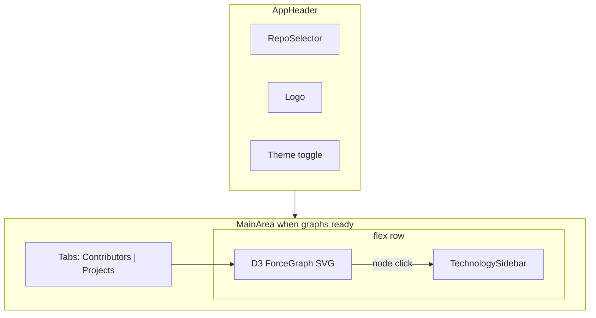
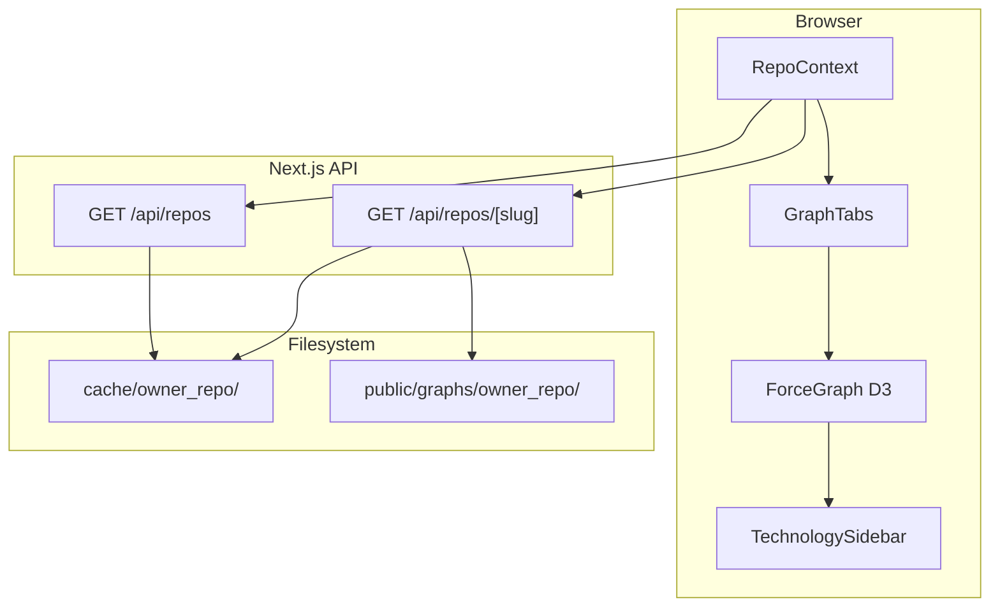
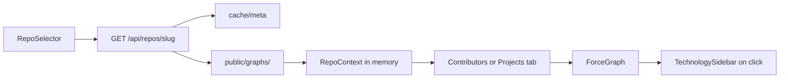

# Phase 4 Frontend UI Plan

## Prerequisites audit (re-evaluated)

Stages 1–3 are **complete in code** per [`.cursor/spec.md`](.cursor/spec.md). The frontend is the only remaining v1 stage.

| Prerequisite | Required for | Status | Local gap |
|--------------|--------------|--------|-----------|
| **Stage 1** scrape | Repo in cache list | **Met** | — |
| **Stage 2** enrich | Compute inputs | **Met** | — |
| **Stage 3** compute | Graphs + skills registry | **Met** — [`compute/src/build.ts`](compute/src/build.ts), [`compute/src/io/publish.ts`](compute/src/io/publish.ts) | Per-machine: not every cached repo recomputed |
| **Published graphs** | Visualization | **Met in pipeline** | Only `react_react` has graphs locally today |
| **Frontend shell** | Layout, theme | **Met** | — |

**Local cache today:**

| Slug | Cache | `compute_meta.json` | `public/graphs/` |
|------|-------|---------------------|------------------|
| `react_react` | Stage 1–3 complete | Yes | Yes (48 nodes, 310 edges; ~158KB total) |
| `redis_redis` | subprojects + skills (pre-graph compute) | No | No — run `cd compute && npm run build -- --repo redis/redis` |

**Contributor skills:** Resolved — `graph.json` nodes include `skills: SkillRef[]`; project nodes include aggregated `skills` in `project_graph.json`. Labels resolved via published `skills.json`.

---

## Resolved decisions

| ID | Choice | Summary |
|----|--------|---------|
| **D11** | **D3** | `d3-force` simulation + `d3-selection` SVG rendering; `d3-zoom` / `d3-drag` for interaction |
| **D12** | **In-app dropdown** | List repos from `cache/` folders |
| **D13 (list)** | **Scan `cache/`** | Dropdown source of truth = scraped repos on disk |
| **D13 (load)** | **API bundle** | Meta from cache + graphs from `public/graphs/<slug>/` |
| **Views** | **Two tabs** | "Contributors" (`graph.json`) and "Projects" (`project_graph.json`) — no third technology tab |
| **Node detail** | **Technology sidebar** | On node click, right sidebar shows **technology/skills only** for the selected contributor or project |
| **Search** | **v2** | Out of v1 scope |
| **Out of scope** | — | Deployment, auth (D14), URL shareability, incremental updates (D15) |

---

## UI layout



**Tab behavior:**
- Switching tabs clears node selection and hides sidebar.
- Each tab mounts its own D3 graph (contributor vs project data shapes differ).
- Preserve zoom/pan within a tab session; reset on tab switch.

**Technology sidebar** ([`frontend/app/components/TechnologySidebar.tsx`](frontend/app/components/TechnologySidebar.tsx)):
- Visible only when a node is selected; collapses when selection cleared.
- **Contributor selected:** resolve `node.skills[]` against `bundle.skills.skills` → display label, optional `kind` badge (`language`, `dependency`), weight.
- **Project selected:** same for `ProjectGraphNode.skills[]`.
- Group by `kind` when present (`Languages`, `Dependencies`, `Other`); omit non-technology fields (team, role, collaborators, paths) from sidebar.
- Empty skills → "No technology data for this node."

**Selection state** — add to graph view context or `MainArea` local state:

```ts
type GraphTab = "contributors" | "projects";
type SelectedNode =
  | { tab: "contributors"; id: string }
  | { tab: "projects"; id: string }
  | null;
```

---

## Architecture



---

## API design

### `GET /api/repos`

Scan `cache/` at repo root. Include dirs with `meta.json`. Return `RepoSummary[]` sorted by `repo`.

### `GET /api/repos/[slug]`

```ts
interface RepoBundle {
  slug: string;
  repo: string;
  meta: CacheMeta;
  computeMeta?: ComputeMetaData;
  readiness: {
    enriched: boolean;
    computed: boolean;
    graphs: boolean;
  };
  graph?: GraphData;
  projectGraph?: ProjectGraphData;
  skills?: SkillsData;
}
```

Do not include raw PR/activity/manifest data. Sanitize slug; 404/422 as before.

---

## D3 graph implementation

**Dependencies** (add to [`frontend/package.json`](frontend/package.json)):

- `d3` (force, selection, zoom, drag, scale)
- `@types/d3`

**Shared component** [`frontend/app/components/ForceGraph.tsx`](frontend/app/components/ForceGraph.tsx):

- Props: `nodes`, `links`, `nodeId`, `nodeLabel`, `onNodeClick`, `theme` (dark/light stroke/fill colors).
- SVG fills parent container; `ResizeObserver` for dimensions.
- `d3.forceSimulation` with `forceLink`, `forceManyBody`, `forceCenter`, `forceCollide`.
- `d3.zoom` on SVG; `d3.drag` on nodes.
- Click node → `onNodeClick(id)`; click background → clear selection.
- Highlight selected node (stroke ring); optional dim non-adjacent nodes.

**Tab wrappers:**
- [`ContributorGraph.tsx`](frontend/app/components/ContributorGraph.tsx) — maps `GraphData` → ForceGraph; avatar as circular clip optional v1 stretch goal.
- [`ProjectGraph.tsx`](frontend/app/components/ProjectGraph.tsx) — maps `ProjectGraphData` → ForceGraph; node size scaled by `total_weight` or `contributor_count`.

**Tab bar** [`frontend/app/components/GraphTabs.tsx`](frontend/app/components/GraphTabs.tsx) — styled tab buttons below header / above graph area.

---

## Client state and data flow

### `RepoContext`

| State | Purpose |
|-------|---------|
| `repos`, `selectedSlug`, `bundle`, `status`, `error` | As before |

On dropdown change: clear bundle + any graph selection.

### `RepoSelector`

Unchanged: native `<select>` in header left; readiness dots; loading spinner.

---

## MainArea states

| State | UI |
|-------|-----|
| No repo selected | "Select a repository" |
| Loading | Skeleton / spinner |
| Error | Banner + retry |
| `readiness.graphs === false` | Summary + compute CTA |
| Graphs ready | `GraphTabs` + active `ForceGraph` + conditional `TechnologySidebar` |

---

## Shared utilities

| File | Purpose |
|------|---------|
| [`frontend/lib/paths.ts`](frontend/lib/paths.ts) | Cache/graph dir helpers, slug conversion |
| [`frontend/lib/types.ts`](frontend/lib/types.ts) | Graph + API types (self-contained copies) |
| [`frontend/lib/repos.ts`](frontend/lib/repos.ts) | `listCachedRepos()`, `loadRepoBundle()` |
| [`frontend/lib/skills.ts`](frontend/lib/skills.ts) | `resolveNodeTechnologies(skills, skillRefs)` → grouped display list for sidebar |

---

## v2 (explicitly out of scope)

- Search / filter by login, subproject, skill
- Deployment hosting model
- Auth / private repos
- URL deep links / shareability
- Incremental scrape/compute refresh UX
- LLM chat panel

---

## Recommended implementation order

1. Run compute for stale cache dirs (`redis_redis`)
2. `lib/` helpers + API routes
3. `RepoContext` + `RepoSelector` + MainArea empty/loading/error states
4. `GraphTabs` shell + selection state
5. `ForceGraph` (D3) with contributor data first
6. `ProjectGraph` tab
7. `TechnologySidebar` wired to selection + `skills.json` lookup
8. **Update [`.cursor/spec.md`](.cursor/spec.md)** — see section below

---

## Spec update (final step)

After frontend implementation is complete, update [`.cursor/spec.md`](.cursor/spec.md) to reflect Stage 4 design and status. Do not duplicate [`.cursor/research.md`](.cursor/research.md) product vision.

### 1. `Current repository state` table

Update the **Frontend** row from "Shell only" to describe implemented UI: repo dropdown, API routes, D3 graphs, contributor/project tabs, technology sidebar.

### 2. Replace `Stage 4 — Frontend visualization (partial)` section

Expand with:

**Goal** (unchanged): contributor + project exploration; technology via skills on nodes + `skills.json` (no separate technology graph).

**Resolved UI decisions:**

| Item | Choice |
|------|--------|
| Graph rendering (**D11**) | D3 (`d3-force`, `d3-selection`, `d3-zoom`, `d3-drag`) |
| Repo selection (**D12**) | In-app dropdown; options from `cache/<owner>_<repo>/` dirs with `meta.json` |
| Data delivery (**D13**) | `GET /api/repos` scans cache; `GET /api/repos/[slug]` returns meta + published graphs from `public/graphs/<slug>/` |
| Views | Two tabs: Contributors (`graph.json`) and Projects (`project_graph.json`) |
| Node detail | `TechnologySidebar` — skills/technology only, resolved from `skills.json` by `kind` |
| Search | **v2** |

**Components / files** (key paths):

- `frontend/app/api/repos/` — list + load routes
- `frontend/lib/` — paths, types, repos, skills helpers
- `frontend/app/components/RepoContext.tsx`, `RepoSelector.tsx`
- `frontend/app/components/GraphTabs.tsx`, `ForceGraph.tsx`, `ContributorGraph.tsx`, `ProjectGraph.tsx`, `TechnologySidebar.tsx`

**Data flow (browser):**



**Status:** Update to **complete** (or **partial** if any checklist item remains) once implemented.

### 3. `Resolved (architecture)` table — add rows

| ID | Choice | Summary |
|----|--------|---------|
| **D11** | **D3** | Force-directed SVG graphs via d3-force |
| **D12** | **In-app dropdown** | Repo list from `cache/` folders |
| **D13** | **API + published graphs** | List from cache; load bundle from `public/graphs/` + cache meta |

### 4. `Architectural decisions to make` — prune and defer

- **Remove** D11, D12, D13 (resolved — summarize in Resolved table + Stage 4 section only).
- **D14** (auth), **D15** (incremental updates): move to **Deferred (v2+)** with note "out of v1 frontend scope; CLI-only scrape/compute for now."
- **D16** (README/CLAUDE drift): keep open; note frontend choices now stable enough to refresh docs when v1 ships.
- Add **v2 frontend** subsection under deferred:
  - Search / filter (login, subproject, skill)
  - URL deep links / shareability
  - Deployment / hosting model (static `public/graphs/` vs API reading cache)
  - LLM chat panel (**D10**)

### 5. `Suggested decision order` — strike through item 3

Mark **D11–D13** as done; next items are D16 doc refresh and v2 features.

---

## File checklist

| File | Action |
|------|--------|
| [`frontend/package.json`](frontend/package.json) | Add `d3`, `@types/d3` |
| [`frontend/lib/paths.ts`](frontend/lib/paths.ts) | Create |
| [`frontend/lib/types.ts`](frontend/lib/types.ts) | Create |
| [`frontend/lib/repos.ts`](frontend/lib/repos.ts) | Create |
| [`frontend/lib/skills.ts`](frontend/lib/skills.ts) | Create |
| [`frontend/app/api/repos/route.ts`](frontend/app/api/repos/route.ts) | Create |
| [`frontend/app/api/repos/[slug]/route.ts`](frontend/app/api/repos/[slug]/route.ts) | Create |
| [`frontend/app/components/RepoContext.tsx`](frontend/app/components/RepoContext.tsx) | Create |
| [`frontend/app/components/RepoSelector.tsx`](frontend/app/components/RepoSelector.tsx) | Create |
| [`frontend/app/components/AppHeader.tsx`](frontend/app/components/AppHeader.tsx) | Edit |
| [`frontend/app/components/GraphTabs.tsx`](frontend/app/components/GraphTabs.tsx) | Create |
| [`frontend/app/components/ForceGraph.tsx`](frontend/app/components/ForceGraph.tsx) | Create |
| [`frontend/app/components/ContributorGraph.tsx`](frontend/app/components/ContributorGraph.tsx) | Create |
| [`frontend/app/components/ProjectGraph.tsx`](frontend/app/components/ProjectGraph.tsx) | Create |
| [`frontend/app/components/TechnologySidebar.tsx`](frontend/app/components/TechnologySidebar.tsx) | Create |
| [`frontend/app/page.tsx`](frontend/app/page.tsx) | Edit |
| [`.cursor/spec.md`](.cursor/spec.md) | Edit — Stage 4 summary + resolved/deferred decisions (final step) |

---

## Test plan

1. Empty `cache/` → dropdown empty state
2. Select `react/react` → bundle loads; Contributors tab shows 48 nodes
3. Click contributor node → sidebar lists resolved skills by kind
4. Switch to Projects tab → project graph renders; contributor selection cleared
5. Click project node → sidebar shows project aggregated skills only
6. `redis_redis` without graphs → compute CTA; no graph tabs
7. Tab switch + rapid repo switch → no stale selection or bundle
8. Zoom/pan/drag on graph; theme toggle updates graph colors
9. `.cursor/spec.md` reflects Stage 4 design; D11–D13 in Resolved table; D14/D15 and search listed under v2 deferred
