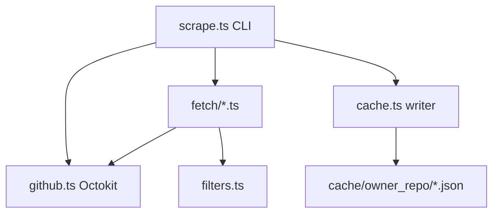

# Stage 1 — GitHub Data Collection

## Goal

Deliver a runnable CLI that, for each repo in `[scraper/src/config.ts](scraper/src/config.ts)` `REPOS` (or a single `--repo`), fetches **D1 A+** data and writes:

```
cache/<owner>_<repo>/
  prs.json          # RawPR[] with per-PR files
  reviews.json      # RawReview[]
  contributors.json # ContributorStat[] (profiles for humans in window)
```

Local-only; not committed. Aligns with `[.cursor/spec.md](.cursor/spec.md)` Stage 1 (lines 60–108).

## Current baseline


| Piece                                              | State                                                           |
| -------------------------------------------------- | --------------------------------------------------------------- |
| `[scraper/src/types.ts](scraper/src/types.ts)`     | `RawPR` missing `files`; `RawReview`, `ContributorStat` defined |
| `[scraper/src/filters.ts](scraper/src/filters.ts)` | `isBot`, `filterActiveContributors` ready                       |
| `[scraper/package.json](scraper/package.json)`     | Octokit + dotenv + tsx; **no `scripts`**                        |
| Entrypoints                                        | None under `scraper/src/`                                       |


## Architecture




**Package boundary (implicit D7):** All new code stays in `scraper/`; no `backend/` or compute in this stage.

## 1. Type and schema updates

Extend `[scraper/src/types.ts](scraper/src/types.ts)`:

```ts
export interface PRFileChange {
  path: string;
  additions: number;
  deletions: number;
}

export interface RawPR {
  // ...existing fields
  files: PRFileChange[];
}
```

Add a small **cache metadata** envelope (recommended for D15 full re-scrape debugging) on each file or a single `meta.json`:

```ts
export interface CacheMeta {
  repo: string;           // "owner/name"
  scraped_at: string;     // ISO
  window_start: string;   // ISO (now - WINDOW_MONTHS)
  pr_count: number;
  review_count: number;
}
```

Optional but low-cost; helps validate window without re-reading all PRs.

## 2. Shared utilities

New modules under `scraper/src/`:


| Module      | Responsibility                                                                                                                                                  |
| ----------- | --------------------------------------------------------------------------------------------------------------------------------------------------------------- |
| `paths.ts`  | `repoToCacheDir("facebook/react")` → `cache/facebook_react` (resolve from **repo root**, not `scraper/`)                                                        |
| `window.ts` | `getWindowStart(WINDOW_MONTHS)` → `Date` / ISO string                                                                                                           |
| `github.ts` | `createOctokit()`: load `GITHUB_TOKEN` from **root** `[.env.example](.env.example)` via `dotenv.config({ path: join(repoRoot, ".env") })`; fail fast if missing |
| `cache.ts`  | `writeCache(repo, { prs, reviews, contributors, meta })` — `mkdir -p`, `JSON.stringify` with stable formatting                                                  |


**Cache location fix:** Spec and data-flow diagram use **repo-root** `cache/`. Today only `[scraper/.gitignore](scraper/.gitignore)` ignores `cache/`. Plan:

- Write to `<repoRoot>/cache/<owner>_<repo>/`
- Add `cache/` to [root `.gitignore](.gitignore)` (keep or remove `scraper/cache/` ignore — harmless either way)

## 3. Fetch implementation (Octokit REST)

### 3.1 Pull requests (time window)

- API: `octokit.paginate(octokit.rest.pulls.list, { owner, repo, state: "all", sort: "created", direction: "desc", per_page: 100 })`
- **Early stop:** Once `pr.created_at < windowStart`, stop paginating (efficient for 6-month window on high-volume repos).
- Map each PR → `RawPR`:
  - `number`, `title`, `author` ← `user.login` (skip PR if author is bot via `isBot`)
  - `created_at`, `labels` ← `labels[].name`
  - `files` ← filled in step 3.3

**Out of scope (per spec):** issues, repo-wide commits, local clone.

### 3.2 Reviews

For each kept PR:

- API: `pulls.listReviews` (paginate if needed)
- Map → `RawReview`: `pr_number`, `reviewer` ← `user.login`, `submitted_at` ← `submitted_at`
- Skip reviews where `isBot(reviewer)` or `state === "DISMISSED"` (optional; keeps signal clean)

### 3.3 Changed files (D1 critical)

For each kept PR:

- API: `pulls.listFiles`
- Map → `{ path: filename, additions, deletions }` (GitHub field is `filename` on [Pull Request Files](https://docs.github.com/en/rest/pulls/pulls#list-pull-requests-files))

### 3.4 Contributors

After PR + review pass:

1. Build `Map<login, activityCount>`: +1 per PR authored, +1 per review submitted (bots excluded).
2. Apply `[filterActiveContributors](scraper/src/filters.ts)` → `Set` of logins for **graph-ready** subset.
3. For **each unique human login** seen in window (not only active — recommend storing all with `total` = activity count; document that compute Stage 3 applies `MIN_ACTIVITY` for nodes). **Spec-consistent minimum:** at least profiles for logins in `filterActiveContributors` output; storing all humans keeps recompute flexible.

Profile enrichment per login:

- API: `users.getByUsername` → `login`, `name`, `avatar_url`
- `total` ← activity count from step 1 (not global commit count; matches “commit count optional”)

**Do not** use `repos.listContributors` as primary source — it is lifetime commit-ranked, not window-aligned.

### 3.5 Rate limits and resilience

Large targets (`facebook/react`, `kubernetes/kubernetes`) imply **2 + N API calls per PR** (list + reviews + files). Plan for:

- **Concurrency cap** (e.g. 5–10 parallel PR detail fetches) via a tiny dependency (`p-limit`) or a simple semaphore — avoids secondary rate limits.
- **Retry with backoff** on `403` / `429` (Octokit `RequestError` + `retry-after` header).
- **Progress logging** per repo: PR count, current PR number, elapsed time.
- **CLI `--repo owner/name`** to scrape one repo during dev; default iterates `REPOS`.

**Full re-scrape only (D15):** Each run overwrites the three JSON files (+ optional `meta.json`).

## 4. CLI entrypoint and npm scripts

New `[scraper/src/scrape.ts](scraper/src/scrape.ts)`:

```
Usage:
  npm run scrape                    # all REPOS
  npm run scrape -- --repo facebook/react
```

Flow per repo: fetch → write cache → log summary (counts, path, duration).

Update `[scraper/package.json](scraper/package.json)`:

```json
"scripts": {
  "scrape": "tsx src/scrape.ts",
  "typecheck": "tsc --noEmit"
}
```

## 5. Output contract (validation)

`**prs.json`:** `RawPR[]` — every item has non-empty `files` array only when GitHub returned files (empty array allowed for trivial PRs).

`**reviews.json`:** `RawReview[]` — `pr_number` references a PR in `prs.json`.

`**contributors.json`:** `ContributorStat[]` — no bot logins; `total` reflects window PR+review actions.

Manual smoke test (document in plan, not committed):

```bash
cp .env.example .env   # add real GITHUB_TOKEN
cd scraper && npm install
npm run scrape -- --repo redis/redis   # smaller than react/k8s
ls ../cache/redis_redis/
```

Spot-check: PR entries include `files[].path`; reviews reference valid PR numbers; contributor count reasonable.

## 6. Explicit non-goals (this stage)

- Stage 2 parse, Stage 3 compute (`GraphData`), Louvain communities
- Issues, comments, assignees, global commit crawl
- Incremental cursors / cache versioning beyond optional `meta.json`
- Frontend or `frontend/public/graphs/*.json`
- README/CLAUDE rewrite (D16 — after D4/D7/D10)

## 7. Risk notes


| Risk                                   | Mitigation                                                                            |
| -------------------------------------- | ------------------------------------------------------------------------------------- |
| Rate limits on 5 full `REPOS`          | Default dev on `--repo`; log rate-limit resets; concurrency cap                       |
| Long runtime (10k+ PRs × 2 calls)      | Early-stop PR list; optional future: skip `files` for bot-only PRs (already excluded) |
| Root-level files in paths (`.github/`) | Store raw paths; Stage 2/3 D2 handles segmentation                                    |
| Token scope                            | Public repos need classic fine-grained or PAT with `public_repo` / repo read          |


## File change summary


| Action         | Path                                                                                                                                                                                                                           |
| -------------- | ------------------------------------------------------------------------------------------------------------------------------------------------------------------------------------------------------------------------------ |
| Extend types   | `[scraper/src/types.ts](scraper/src/types.ts)`                                                                                                                                                                                 |
| Add            | `scraper/src/scrape.ts`, `github.ts`, `cache.ts`, `paths.ts`, `window.ts`, `fetch/prs.ts`, `fetch/reviews.ts`, `fetch/files.ts`, `fetch/contributors.ts` (or single `fetch.ts` if < ~250 lines — prefer split for testability) |
| Update scripts | `[scraper/package.json](scraper/package.json)`                                                                                                                                                                                 |
| Ignore cache   | `[.gitignore](.gitignore)`                                                                                                                                                                                                     |


Optional follow-up (not blocking Stage 1): minimal tests for `repoToCacheDir`, `getWindowStart`, and bot filtering on sample fixtures.