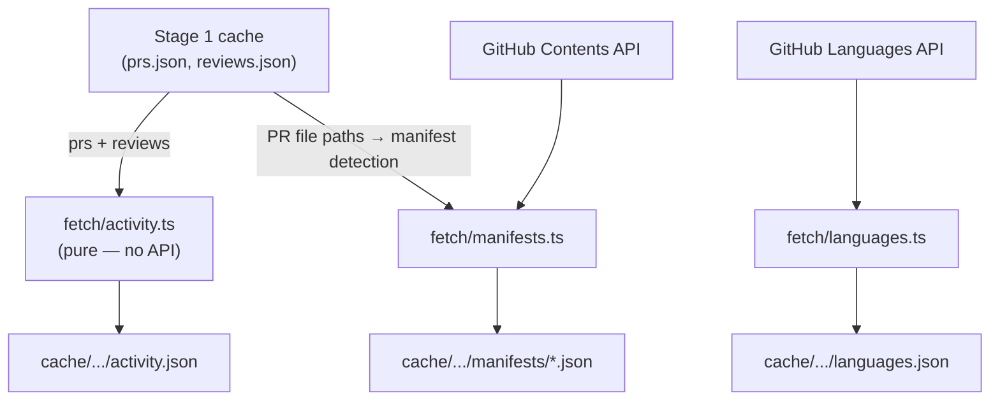

# Stage 2 Enrichment (`scraper/`)

## What gets added

Three new files per `cache/<owner>_<repo>/`:

- `languages.json` — Linguist language → byte count map
- `manifests/<path-key>.json` — parsed deps for each manifest file fetched
- `activity.json` — unified PR-author + review event stream (spec schema verbatim)

## New files (all under `scraper/src/fetch/`)

### `scraper/src/fetch/languages.ts`

Single function `fetchLanguages(octokit, owner, repo)` — one call to `GET /repos/{owner}/{repo}/languages`, returns `Record<string, number>`.

### `scraper/src/fetch/manifests.ts`

- Root allowlist: `package.json`, `go.mod`, `Cargo.toml`, `requirements.txt`, `pyproject.toml`
- Union with any matching basename from PR `files` (e.g. `packages/ui/package.json` detected from PR changed paths)
- Fetches each via `GET /repos/{owner}/{repo}/contents/{path}` (no `ref` → default branch)
- Decodes base64 content; parses deps for known formats:
  - `package.json` → `JSON.parse` → union of `dependencies`, `devDependencies`, `peerDependencies`
  - `go.mod` → regex on `require` block lines
  - `Cargo.toml` → regex on `[dependencies]` / `[dev-dependencies]` sections
  - others → `deps: {}`, `raw` stored as-is
- Path-key: `path.replace(/\//g, "_")` → filename for `manifests/<key>.json`
- Per-file schema:
  ```ts
  { source_path: string; fetched_at: string; deps: Record<string, string> }
  ```

### `scraper/src/fetch/activity.ts`

Pure function `buildActivity(prs, reviews)` — no API calls.

- Emits `{ kind: "pr_author", login, pr, at, paths, title }` for each `RawPR`
- Emits `{ kind: "review", login, pr, author, at }` for each `RawReview` (uses `prs` map to resolve `author`)
- Events sorted by `at` ascending
- Returns `ActivityData` with `version: 1`, `generated_at`, `events[]`

### `scraper/src/fetch/enrich.ts`

Coordinator: `enrichRepo(octokit, owner, repo, prs, reviews)` — calls all three fetch modules, then writes cache via `writeEnrichCache`. Mirrors how `scrape.ts` orchestrates `fetch/prs.ts` and `fetch/contributors.ts`.

## Modified files

### `[scraper/src/types.ts](scraper/src/types.ts)`

Add:

```ts
export type ActivityEvent =
  | { kind: "pr_author"; login: string; pr: number; at: string; paths: string[]; title: string }
  | { kind: "review"; login: string; pr: number; author: string; at: string };

export interface ActivityData {
  version: number;
  generated_at: string;
  events: ActivityEvent[];
}

export interface ManifestEntry {
  source_path: string;
  fetched_at: string;
  deps: Record<string, string>;
}
```

Also add `skills: { id: string; weight: number }[]` to `GraphNode` (per D3/spec).

### `[scraper/src/cache.ts](scraper/src/cache.ts)`

Add `writeEnrichCache(repo, { languages, manifests, activity })`:

- Writes `languages.json`
- `mkdirSync` the `manifests/` subdir; writes one JSON per entry
- Writes `activity.json`

### `[scraper/src/scrape.ts](scraper/src/scrape.ts)`

After `writeCache(...)`, call `enrichRepo` from `./fetch/enrich` with the same `log` helper. Update the summary log line to mention Stage 2 artifacts.

## Data flow




## Commands (after implementation)

```bash
cd scraper && npm run scrape -- --repo redis/redis   # runs Stage 1 + Stage 2
npm run typecheck
```

No new npm dependencies required — `@octokit/rest` and built-in `Buffer.from(..., 'base64')` cover all needs.