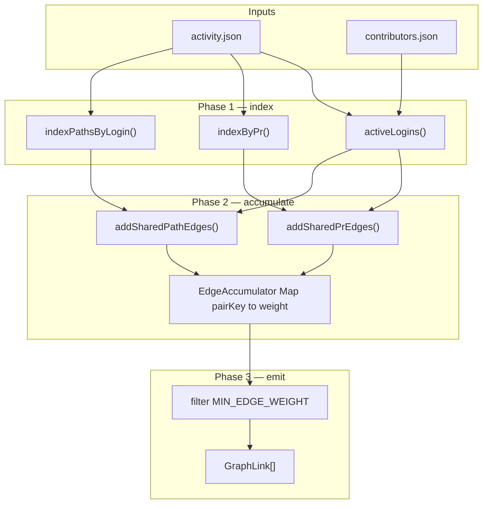

# Stage 3 — Collaboration Edges (D6)

## Scope

This plan covers **only** spec Stage 3 step 3 (`[.cursor/spec.md](.cursor/spec.md)` lines 237–241): the collaboration-edge algorithm and its integration into `compute/`.

**In scope:** `buildCollaborationEdges()` → `GraphLink[]` (`source`, `target`, `weight`).

**Out of scope (separate passes):** full `graph.json` / `project_graph.json` assembly, `compute_meta.json`, Louvain communities (D5), issue comments, off-PR co-authors (D1).

**Document roles:** `[.cursor/spec.md](.cursor/spec.md)` stays the architecture source. This plan is the saved implementation detail — same pattern as `[.cursor/plans/stage_3_subprojects_7451b3b8.plan.md](.cursor/plans/stage_3_subprojects_7451b3b8.plan.md)` and `[.cursor/plans/stage_3_skills_4e4f6918.plan.md](.cursor/plans/stage_3_skills_4e4f6918.plan.md)`.

**Primary input:** `[cache/<owner>_<repo>/activity.json](scraper/src/fetch/activity.ts)` + `[contributors.json](scraper/src/fetch/contributors.ts)`. No reads of raw `prs.json` / `reviews.json` (activity is ensured via existing `[ensureActivity()](compute/src/io/activity.ts)`).

---

## Inputs and node set


| Input                  | Used for                                           |
| ---------------------- | -------------------------------------------------- |
| `activity.json` events | PR co-participation + author path touches          |
| `contributors.json`    | Active node filter (`MIN_ACTIVITY`, bot exclusion) |


**Active contributors** — same rule as subprojects/skills (`[compute/src/subprojects/build.ts](compute/src/subprojects/build.ts)`):

```ts
!isBot(login) && contributor.total >= MIN_ACTIVITY
```

Edges are **only between active logins**. Non-active humans may appear in activity but are ignored for both endpoints.

**Self-loops:** excluded.

**Undirected storage:** canonicalize each pair as `(min(loginA, loginB), max(loginA, loginB))` lexicographically; emit one `GraphLink` per pair.

---

## Constants (add / wire)

Spec reserves these in `[scraper/src/config.ts](scraper/src/config.ts)`; they are **not yet in code** — add them there and import in `compute/` (same pattern as `MIN_ACTIVITY`).


| Constant              | Value   | Purpose                                                                               |
| --------------------- | ------- | ------------------------------------------------------------------------------------- |
| `LAMBDA`              | `0.005` | Per-day recency decay                                                                 |
| `REVIEW_WEIGHT`       | `1.0`   | Author↔reviewer per review event                                                      |
| `CO_PRESENCE_WEIGHT`  | `0.25`  | Reviewer↔reviewer (or other non-review co-presence) on same PR, once per pair per PR  |
| `PATH_OVERLAP_WEIGHT` | `0.5`   | Base scale for shared-path signal (spec TBD slot)                                     |
| `MIN_EDGE_WEIGHT`     | `0.05`  | Drop noise links after accumulation                                                   |
| `MAX_PATH_FANOUT`     | `40`    | Skip paths touched by more than this many active contributors (README/`go.mod` guard) |


Half-life at `LAMBDA=0.005`: ~139 days — reasonable for a 3–6 month window.

---

## Recency helper

Every weighted contribution is multiplied by recency at event time `t`:

```ts
function recencyFactor(at: string, computeAt: Date, lambda = LAMBDA): number {
  const days = (computeAt.getTime() - new Date(at).getTime()) / 86_400_000;
  return Math.exp(-lambda * Math.max(0, days));
}
```

**Reference time `computeAt`:** `new Date()` at compute run (simple; matches “current relevance”). Alternative later: `meta.scraped_at` for bit-identical re-runs on stale cache.

---

## End-to-end flow




| Phase | Reads                                | Writes                 | Question answered                            |
| ----- | ------------------------------------ | ---------------------- | -------------------------------------------- |
| 1     | `activity.json`, `contributors.json` | in-memory indexes      | Who is in the graph? How are events grouped? |
| 2     | indexes                              | `Map<pairKey, number>` | How strongly did each pair collaborate?      |
| 3     | accumulator                          | `GraphLink[]`          | Which links are worth rendering?             |


---

## Signal 1 — Shared PR activity

### Index by PR

Single pass over `activity.events`:

```ts
interface PrBucket {
  author: string | null;
  authorAt: string | null;
  authorPaths: string[];       // from pr_author (for dedupe guard only)
  reviews: Array<{ login: string; at: string }>;
}
```

- `pr_author` → set `author`, `authorAt`, `authorPaths`
- `review` → append `{ login, at }` (skip if not active or `author` empty)

### Per-PR pair rules

For each PR with author `A` and review list `R[]`:

**A. Author ↔ reviewer (primary signal)**

For each review event `(reviewer=B, at=t)`:

```
edge(A,B) += REVIEW_WEIGHT * recency(t)
```

Each review event is independent (re-requested reviews, multiple rounds).

**B. Co-presence on same PR (secondary signal)**

Let `participants = {A} ∪ unique review logins`. For each unordered pair `(P,Q)` where neither is a review-author pair already fully covered…

Simpler v1 rule: for each unordered pair `(P,Q)` among participants where **both are reviewers** (neither is the author, or author not involved):

```
edge(P,Q) += CO_PRESENCE_WEIGHT * recency(authorAt ?? earliest review at)
```

Once per `(PR, pair)`. Author↔reviewer weight comes **only** from review events (A), not co-presence — avoids double-counting.

**Out of scope:** issue comments (`CO_COMMENT_WEIGHT` reserved in spec, unused).

### Worked example

PR #42: `author=alice`, `authorAt=T0`, paths irrelevant for this signal.

Reviews: `bob@T1`, `carol@T2`.


| Pair        | Contribution         |
| ----------- | -------------------- |
| alice↔bob   | `1.0 * recency(T1)`  |
| alice↔carol | `1.0 * recency(T2)`  |
| bob↔carol   | `0.25 * recency(T0)` |


---

## Signal 2 — Shared changed paths (IDF-weighted)

**Evidence source:** `pr_author` events only (reviewers have no paths in v1 — consistent with D2).

### Path index per contributor

Reuse `[normalizePath()](compute/src/subprojects/normalize.ts)` (same hygiene as subprojects).

For each `pr_author` event by active login `L` at time `t`:

```
paths[L][p].touches += 1   // dedupe duplicate paths within same event
paths[L][p].latestAt = max(latestAt, t)
```

### Inverted index

```
pathToLogins: Map<path, Set<login>>
```

Only paths where `1 < fanout <= MAX_PATH_FANOUT` participate (skip singletons and ubiquitous files).

### IDF-weighted overlap

Let `N = |activeLogins|`, `fanout = |pathToLogins[p]|`:

```
idf(p) = Math.log(N / fanout)   // natural log; fanout >= 2 here
```

For each path `p` and each unordered active pair `(A,B)` on that path:

```
overlap = min(paths[A][p].touches, paths[B][p].touches)
t = max(paths[A][p].latestAt, paths[B][p].latestAt)

edge(A,B) += PATH_OVERLAP_WEIGHT * overlap * idf(p) * recency(t)
```

**Rationale (user choice):** rare shared files (small fanout) dominate; `README.md`-scale paths are capped by `MAX_PATH_FANOUT`.

### Cross-signal dedupe (v1 safeguard)

Spec: *“Same path on the same PR counts under both signals.”*

With one author per PR and reviewers path-less, author↔reviewer pairs **cannot** double-count path + PR on the same PR. The safeguard matters if co-authors are added later:

```ts
// Optional per (pr, pair, path) cap — implement as comment/TODO unless needed
// combinedSamePr = min(prContribution, pathContribution) not additive
```

No extra logic required for current `[buildActivity()](scraper/src/fetch/activity.ts)` shape.

---

## Accumulator and emit

```ts
// compute/src/edges/build.ts
export function buildCollaborationEdges(
  activity: ActivityData,
  contributors: ContributorStat[]
): GraphLink[]

function pairKey(a: string, b: string): string {
  return a < b ? `${a}\0${b}` : `${b}\0${a}`;
}
```

**Emit:**

1. Filter `weight >= MIN_EDGE_WEIGHT`
2. Map to `{ source, target, weight }` (lexicographic source/target)
3. Sort links by `weight` desc, then `source`, then `target` (stable debug output)

**No cache artifact** — edges live in published `[graph.json](scraper/src/types.ts)` (`GraphData.links`) when graph assembly lands.

---

## Integration in `compute/src/build.ts`

After skills, before done log:

```ts
const links = buildCollaborationEdges(activity, contributors);
log(repo, `Built ${links.length} collaboration edges`);
// graph.json assembly (future): nodes + links + subprojectFields + skills
```

Wire-only in this pass; full publish is a follow-up task.

---

## File layout


| File                                             | Role                                                                                                                   |
| ------------------------------------------------ | ---------------------------------------------------------------------------------------------------------------------- |
| `[scraper/src/config.ts](scraper/src/config.ts)` | Add `LAMBDA`, `REVIEW_WEIGHT`                                                                                          |
| `[compute/src/config.ts](compute/src/config.ts)` | Import/re-export edge constants; add `CO_PRESENCE_WEIGHT`, `PATH_OVERLAP_WEIGHT`, `MIN_EDGE_WEIGHT`, `MAX_PATH_FANOUT` |
| `compute/src/edges/recency.ts`                   | `recencyFactor()`                                                                                                      |
| `compute/src/edges/build.ts`                     | `buildCollaborationEdges()`, PR + path passes, accumulator                                                             |
| `[compute/src/build.ts](compute/src/build.ts)`   | Call edge builder; log counts                                                                                          |


**Shared helper (optional, low priority):** extract duplicated `activeLogins()` from subprojects/skills into `compute/src/active.ts` — only if touching those files anyway.

---

## Complexity and performance


| Step                  | Complexity            | Notes                                    |
| --------------------- | --------------------- | ---------------------------------------- |
| PR indexing           | O(events)             | Linear                                   |
| PR pair enumeration   | O(Σ k²) per PR        | k = participants per PR; typically small |
| Path inverted index   | O(total path touches) | Linear                                   |
| Path pair enumeration | O(Σ m²) per path      | m = fanout; capped by `MAX_PATH_FANOUT`  |


For large OSS repos (k8s, rust), path fanout cap is critical. If edge counts are still huge, tune `MIN_EDGE_WEIGHT` upward before frontend work.

---

## Verification

**Unit tests** (`compute/src/edges/build.test.ts` or similar):

- Synthetic 3-person activity: author + 2 reviewers → review + co-presence weights
- Two authors, shared path with different fanout → IDF difference
- Path with fanout > `MAX_PATH_FANOUT` → ignored
- Inactive login excluded from edges
- Recency: older event weighs less (mock `computeAt`)

**Integration (manual):**

```bash
cd scraper && npm run scrape -- --repo redis/redis
cd compute && npm run build -- --repo redis/redis
# Expect non-zero link count in build log; spot-check top pairs make sense
```

Sanity expectations:

- **redis/redis** — small contributor set; strong author↔reviewer edges on active PRs
- **kubernetes/kubernetes** — many edges but fanout cap prevents complete graph from `README`-class paths
- **react/react** — path signal across `packages/`* with IDF favoring package-local shared files

---

## Relationship to downstream Stage 3 steps

```mermaid
flowchart TD
  activity["activity.json"]
  edges["buildCollaborationEdges()"]
  subprojects["subprojects.json"]
  skills["skills.json"]
  graph["graph.json"]
  projectGraph["project_graph.json"]

  activity --> edges
  activity --> subprojects
  activity --> skills
  subprojects --> graph
  skills --> graph
  edges --> graph
  subprojects --> projectGraph
```


`project_graph.json` links (shared contributors between subprojects) reuse the **same contributor adjacency** conceptually but aggregate at subproject level — separate implementation; not part of this plan.

---

## Non-goals

- Issue/comment edges (`CO_COMMENT_WEIGHT`)
- Co-authored commits off-PR
- Reviewer path inference (no paths on `review` events)
- Community detection / Louvain (D5)
- Persisting edges outside `graph.json`
- LLM or ML edge scoring (D10 v2)

