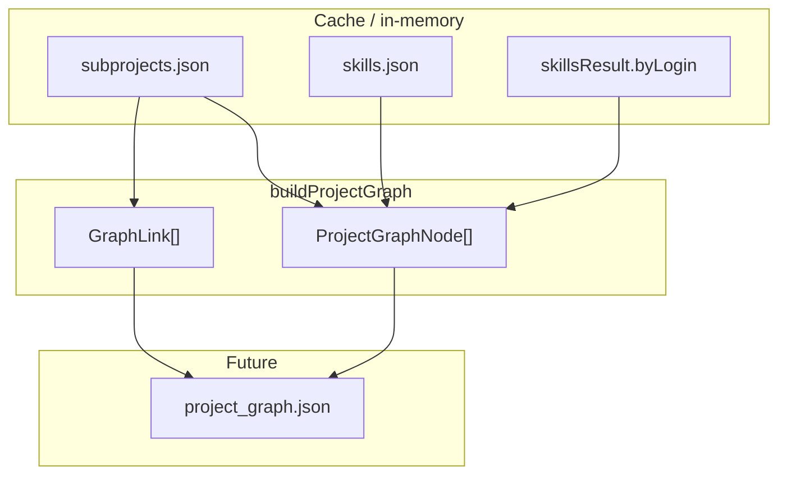
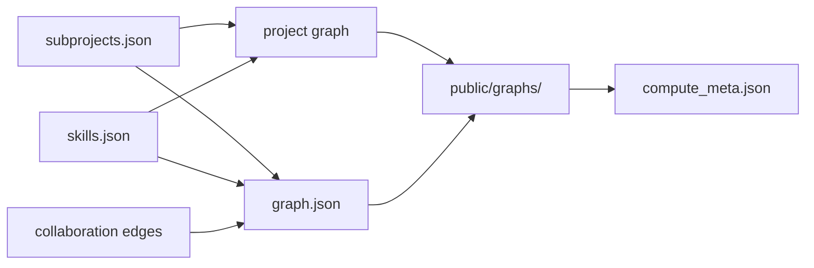

# Stage 3 — Project Graph

## Scope

This plan covers **only** spec Stage 3 step 4 (`[.cursor/spec.md](.cursor/spec.md)` lines 243–244, 318): building the **project graph** from existing subproject and skill artifacts.

**In scope:** `buildProjectGraph()` → `ProjectGraphData` (`nodes` + `links`).

**Out of scope (separate passes):** contributor `graph.json` assembly, writing to `frontend/public/graphs/`, `compute_meta.json`, Louvain (D5), manifest **dependency edges** between subprojects (no separate technology graph per **D4**), PR-title subproject signals (v2), **unit tests**.

**Document roles:** `[.cursor/spec.md](.cursor/spec.md)` stays architecture source. This plan mirrors `[.cursor/plans/stage_3_collaboration_edges_949f0aca.plan.md](.cursor/plans/stage_3_collaboration_edges_949f0aca.plan.md)` — saved implementation detail, not duplicated back into `spec.md`.

**Primary inputs:**

- `[subprojects.json](compute/src/subprojects/build.ts)` — node IDs, labels, `contributor_weights`, `total_weight`, `sample_paths`
- `[skills.json](compute/src/skills/build.ts)` + in-memory `byLogin` from `buildSkills()` — per-contributor `SkillRef[]` for skill aggregation on nodes

No re-read of `activity.json` for link math (membership is already in `subprojects.json`).

---

## Relationship to upstream artifacts




| Upstream               | Consumed for                                                     |
| ---------------------- | ---------------------------------------------------------------- |
| `subprojects.json`     | Node list, labels, weights, samples, contributor sets            |
| `skillsResult.byLogin` | Skill weights per contributor (scaled into each subproject node) |
| `skills.json`          | Canonical skill filter (only promoted IDs on nodes)              |


Collaboration edges (`[compute/src/edges/build.ts](compute/src/edges/build.ts)`) are **not** an input — project links are derived independently from shared `contributor_weights`, as noted in the collaboration-edges plan.

---

## Output schema

Add to `[compute/src/types.ts](compute/src/types.ts)`:

```ts
export interface ProjectGraphNode {
  id: string;              // subproject ID (e.g. "packages/react-dom", "_root")
  name: string;              // label from subprojects.json
  total_weight: number;
  contributor_count: number;
  sample_paths: string[];
  skills: SkillRef[];        // aggregated from member contributors
  top_contributors: Array<{ login: string; weight: number }>;
}

export interface ProjectGraphData {
  repo: string;
  generated_at: string;
  nodes: ProjectGraphNode[];
  links: GraphLink[];        // reuse scraper GraphLink — source/target are subproject IDs
}
```

Reuse `[GraphLink](scraper/src/types.ts)` (`source`, `target`, `weight`) so the frontend can share link-rendering logic between people and project views.

---

## Nodes — one per subproject

**Source of truth:** keys of `subprojects.subprojects` (post-prune, active contributors only — already enforced by `[buildSubprojects()](compute/src/subprojects/build.ts)`).

For each subproject entry `S`:


| Field               | Derivation                                                                                 |
| ------------------- | ------------------------------------------------------------------------------------------ |
| `id`                | subproject key                                                                             |
| `name`              | `sub.label`                                                                                |
| `total_weight`      | `sub.total_weight`                                                                         |
| `contributor_count` | `Object.keys(sub.contributor_weights).length`                                              |
| `sample_paths`      | `sub.sample_paths` (passthrough, max 10)                                                   |
| `top_contributors`  | Sort `contributor_weights` by weight desc; take top `MAX_TOP_CONTRIBUTORS` (suggest **8**) |
| `skills`            | See skill aggregation below                                                                |


**Node sort order:** `total_weight` desc, then `id` asc (stable, largest areas first).

**Include `_root`:** yes — it is a valid subproject bucket after prune/reassign.

---

## Skill aggregation per subproject

Spec: *"aggregated skill IDs from member contributors"* (**D3** / **D4** — skills on nodes, not a separate graph).

For subproject `S` with `contributor_weights[S][L]`:

```ts
for each login L in contributor_weights[S]:
  for each { id, weight } in byLogin[L] ?? []:
    if id not in canonical skills: skip
    acc[id] += weight * contributor_weights[S][L]
```

- Multiply contributor skill weight by their **subproject touch weight** so heavy contributors shape the subproject’s technology profile.
- Keep top `MAX_SUBPROJECT_SKILLS` (suggest **15**, or reuse `MAX_CONTRIBUTOR_SKILLS` = 20 from `[compute/src/config.ts](compute/src/config.ts)`).
- Sort by aggregated weight desc, then `id` asc.

**Do not** re-run extractors or read `activity.json` — reuse `skillsResult` from the same `computeRepo()` pass.

**Language-only skills** (`languages.json` promoted with no per-contributor hits) are **not** attached to subproject nodes in v1 — they lack contributor provenance. Repo-wide language context remains in `skills.json` for filters.

---

## Links — shared contributor membership

**Spec rule:** edges between subprojects weighted by **shared contributors**.

### Formula (v1)

For each unordered subproject pair `(S, T)`:

```
sharedWeight(S, T) = Σ_{L ∈ contributors(S) ∩ contributors(T)} min(w_S(L), w_T(L))
```

Where `w_S(L) = subprojects[S].contributor_weights[L]`.

**Rationale:**

- Binary “count shared logins” loses strength signal; using `min` credits overlap proportional to how deeply each person worked in both areas.
- Symmetric and deterministic; no recency (subproject weights are already window-scoped touch counts).
- Aligns with `[subprojectFieldsForContributor()](compute/src/subprojects/graph-fields.ts)` using the same `contributor_weights` map.

### Emit rules

- Skip self-loops.
- Canonicalize pair: `source < target` lexicographically (same as `[pairKey](compute/src/edges/build.ts)` pattern).
- Drop links where `sharedWeight < MIN_PROJECT_EDGE_WEIGHT` (suggest **1** — at least one full touch-unit of overlap).
- Sort links: `weight` desc, `source`, `target`.

### Worked example


| Subproject | alice | bob | carol |
| ---------- | ----- | --- | ----- |
| `server`   | 10    | 4   | 0     |
| `client`   | 3     | 8   | 2     |


| Pair              | Shared logins | Calculation                  | Weight                         |
| ----------------- | ------------- | ---------------------------- | ------------------------------ |
| `client`↔`server` | alice, bob    | min(3,10) + min(8,4) = 3 + 4 | **7**                          |
| `client`↔`other`  | carol only    | —                            | no link if no third subproject |


---

## Constants (add to `compute/src/config.ts`)


| Constant                  | Suggested | Purpose                          |
| ------------------------- | --------- | -------------------------------- |
| `MIN_PROJECT_EDGE_WEIGHT` | `1`       | Min shared-weight to emit a link |
| `MAX_SUBPROJECT_SKILLS`   | `15`      | Cap skills on each project node  |
| `MAX_TOP_CONTRIBUTORS`    | `8`       | Cap `top_contributors` for UI    |


No new scraper constants — project graph is compute-only.

---

## End-to-end flow

```mermaid
flowchart TD
  subgraph inputs [Inputs]
    subproj["SubprojectsData"]
    skills["SkillsBuildResult"]
  end

  subgraph phase1 [Phase 1 — nodes]
    buildNodes["buildProjectNodes()"]
  end

  subgraph phase2 [Phase 2 — links]
    buildLinks["buildProjectLinks()"]
  end

  subgraph phase3 [Phase 3 — assemble]
    graph["ProjectGraphData"]
  end

  subproj --> buildNodes
  skills --> buildNodes
  subproj --> buildLinks
  buildNodes --> graph
  buildLinks --> graph
```


| Phase | Reads                                   | Writes               |
| ----- | --------------------------------------- | -------------------- |
| 1     | `subprojects`, `byLogin`, `skills.data` | `ProjectGraphNode[]` |
| 2     | `subprojects`                           | `GraphLink[]`        |
| 3     | nodes + links                           | `ProjectGraphData`   |


---

## API

```ts
// compute/src/project-graph/build.ts
export function buildProjectGraph(
  repo: string,
  subprojects: SubprojectsData,
  skillsResult: SkillsBuildResult
): ProjectGraphData
```

Internal helpers (same file or split if > ~200 lines):

- `aggregateSubprojectSkills(sub, byLogin, canonicalSkills): SkillRef[]`
- `buildProjectLinks(subprojects): GraphLink[]`

---

## Integration in `[compute/src/build.ts](compute/src/build.ts)`

After collaboration edges:

```ts
log(repo, "Building project graph...");
const projectGraph = buildProjectGraph(repo, subprojects, skillsResult);
log(repo, `Built project graph — ${projectGraph.nodes.length} nodes, ${projectGraph.links.length} links`);
```

Update the final summary line to include project graph counts.

**Wire-only** — no `writeProjectGraph()` yet (same as collaboration edges; full publish is a follow-up with `graph.json`).

---

## File layout


| File                                             | Role                                                                       |
| ------------------------------------------------ | -------------------------------------------------------------------------- |
| `[compute/src/types.ts](compute/src/types.ts)`   | `ProjectGraphNode`, `ProjectGraphData`                                     |
| `[compute/src/config.ts](compute/src/config.ts)` | `MIN_PROJECT_EDGE_WEIGHT`, `MAX_SUBPROJECT_SKILLS`, `MAX_TOP_CONTRIBUTORS` |
| `compute/src/project-graph/build.ts`             | `buildProjectGraph()`, node + link builders                                |
| `[compute/src/build.ts](compute/src/build.ts)`   | Call project graph builder; log counts                                     |


---

## Complexity


| Step       | Complexity     | Notes                                                                          |
| ---------- | -------------- | ------------------------------------------------------------------------------ |
| Node build | O(P × (C × S)) | P = subprojects, C = contributors/subproject, S = skills/contributor           |
| Link build | O(P² × C)      | P is small after `MIN_SUBPROJECT_WEIGHT` prune (typically tens, not thousands) |


No fanout cap needed — subproject count is bounded by directory structure + prune.

---

## Verification

**Integration (manual):**

```bash
cd scraper && npm run scrape -- --repo redis/redis
cd compute && npm run build -- --repo redis/redis
# Expect non-zero project nodes + links in build log
```

Sanity expectations:

- **redis/redis** — few subprojects; links where contributors touch multiple areas
- **react/react** — `packages/`* nodes with cross-package links via shared maintainers
- **kubernetes/kubernetes** — many subprojects under `pkg/`; links cluster by shared SIG contributors

---

## Non-goals

- Unit tests
- Publishing `frontend/public/graphs/<repo>/project_graph.json`
- Contributor `graph.json` node assembly
- Recency decay on project links (subproject weights are un-decayed touch counts in v1)
- Manifest/dependency edges between subprojects
- Louvain clustering on project graph
- PR title tokens for subproject labeling (v2)

---

## Relationship to remaining Stage 3 work




This plan completes the **project view** data structure. A subsequent pass can add `writeGraphs()` to emit both JSON files and `compute_meta.json`.