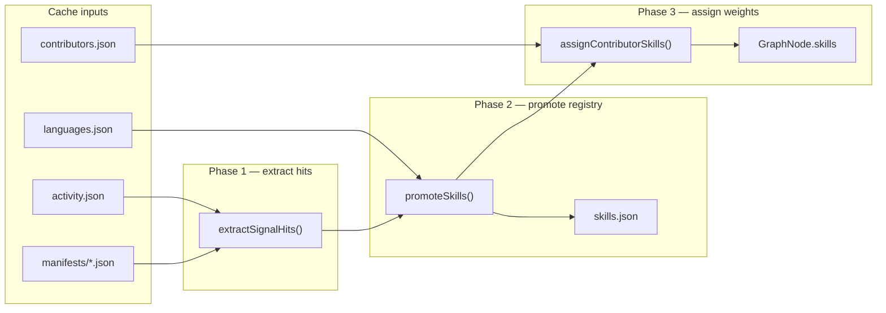

# Stage 3 — Contributor Skills (D3)

## Scope

This plan covers **only** spec Stage 3 step 2 ([`.cursor/spec.md`](.cursor/spec.md) lines 215–219): provisional signal extraction, `skills.json` promotion, and per-contributor `skills: { id, weight }[]` assignment.

**Out of scope here:** subprojects (D2 — already planned in [`.cursor/plans/stage_3_subprojects_7451b3b8.plan.md`](.cursor/plans/stage_3_subprojects_7451b3b8.plan.md)), collaboration edges (D6), full `graph.json` / `project_graph.json` assembly, `compute_meta.json`, PR title tokens (deferred to subprojects v2 — titles name feature areas, not skills), and `GraphNode.expertise`.

**Document roles:** [`.cursor/spec.md`](.cursor/spec.md) stays architecture-level. **This plan** is the saved implementation detail for the skills component.

**v1 labeling philosophy:** v1 emits **provisional, deterministic** labels derived directly from evidence (extension map, dep name, path segment). **v2** will use machine learning to produce better human-facing labels for both `skills.json` entries and `subprojects.json` labels. v1 should not invest in heuristic per-signal classification — keep extractors dumb and uniform.

---

## Inputs and prerequisites

| Input | Source | Role in skills |
|-------|--------|----------------|
| [`activity.json`](scraper/src/fetch/activity.ts) | Stage 2 | `pr_author.paths[]` only (extensions, path hints, manifest attribution). `pr_author.title` is **not** read for skills. |
| [`manifests/*.json`](scraper/src/fetch/manifests.ts) | Stage 2 | Dependency names as `dep:*` skills |
| [`languages.json`](scraper/src/fetch/languages.ts) | Stage 2 | Repo-wide Linguist languages → canonical `lang:*` entries |
| [`contributors.json`](scraper/src/fetch/contributors.ts) | Stage 1 | `MIN_ACTIVITY` filter (reuse [`compute/src/subprojects/build.ts`](compute/src/subprojects/build.ts) `activeLogins` pattern) |

**Required before skills run:** `activity.json` (via existing [`ensureActivity()`](compute/src/io/activity.ts)). `languages.json` and `manifests/` are optional — skills build degrades gracefully to extension + path signals only.

**Attribution scope (v1):** `pr_author` events only (`paths[]` field). Review events lack paths in the activity schema; reviewer skill inference from reviewed PRs is a **non-goal** for v1 (same as subprojects).

---

## End-to-end pipeline



| Phase | Reads | Writes | Question it answers |
|-------|-------|--------|---------------------|
| 1 | `activity.json`, `manifests/` | in-memory hit maps | What raw signals did each contributor emit? |
| 2 | repo-wide counts + `languages.json` | `skills.json` | Which signals are canonical for this repo? |
| 3 | canonical IDs + per-login counts | `SkillRef[]` per active login | What skills does each person carry on the graph? |

Wire into [`compute/src/build.ts`](compute/src/build.ts) after `buildSubprojects()`:

```ts
const skills = buildSkills(repo, cacheDir, activity, contributors);
writeSkills(cacheDir, skills.data);
// assignContributorSkills() consumed later by graph builder
```

---

## Signal model

All provisional signals normalize to a **slug ID** + **label**. The ID **prefix encodes the source**; do not assign different metadata to signals from the same source.

```ts
// compute/src/skills/types.ts
interface ProvisionalSignal {
  id: string;       // e.g. "lang:typescript", "dep:react", "path:wasm"
  label: string;    // display string — provisional in v1; ML-refined in v2
  source: "extension" | "language" | "manifest" | "path";
}

interface SignalHit {
  login: string;
  signal: ProvisionalSignal;
  weight: number;   // usually 1 per deduped source per PR event
  at: string;       // PR created_at — for optional recency
}
```

**Per-source `kind` in `skills.json`** — uniform within a source, not per individual signal:

| Source (ID prefix) | `kind` in registry | Notes |
|--------------------|-------------------|-------|
| `lang:` (extensions + `languages.json`) | `"language"` | All language signals share this kind |
| `dep:` (manifests) | `"dependency"` | All deps share this kind; no framework vs library split |
| `path:` (path segments) | *(omit)* | Domain hints — label only; no `kind` property |

Do **not** vary `kind` within a source (e.g. no `framework` vs `library` for deps). Frontend technology filtering in v1 groups on these coarse source-level kinds; v2 ML may introduce richer taxonomy.

**ID conventions** (stable, per-repo, no global taxonomy):

| Prefix | Example | Source |
|--------|---------|--------|
| `lang:` | `lang:rust` | file extension map or `languages.json` |
| `dep:` | `dep:tokio` | manifest `deps` keys |
| `path:` | `path:wasm` | meaningful path segment |

Use `slugify(label)` for suffix (lowercase, alphanum + hyphen).

---

## Phase 1 — Signal extractors

One `pr_author` event produces hits from **three** extractors (extensions, path segments, manifest deps). **Dedupe within a single PR event** per `(login, signal.id)` so one PR touching 20 `.ts` files counts once for `lang:typescript`.

### 1a. Extensions → languages

New [`compute/src/skills/extensions.ts`](compute/src/skills/extensions.ts):

- Static `EXT_TO_LANGUAGE: Record<string, string>` covering demo repos (`.ts`/`.tsx` → TypeScript, `.js`/`.jsx` → JavaScript, `.go` → Go, `.rs` → Rust, `.py` → Python, `.java` → Java, `.c`/`.h` → C, `.cpp`/`.cc` → C++, `.yaml`/`.yml` → YAML, `.json` → JSON, `.md` → Markdown, `.sh` → Shell, …).
- Skip extensionless paths and binary-ish extensions (`.png`, `.svg`, `.lock`).
- All emit `source: "extension"` → registry `kind: "language"`.

### 1b. Path segments → domain hints

New [`compute/src/skills/paths.ts`](compute/src/skills/paths.ts):

- Split normalized path on `/`; consider segments not in `GENERIC_PATH_SEGMENTS` (reuse spirit of [`DEFAULT_ENTER_DIRS`](compute/src/config.ts) plus `test`, `tests`, `docs`, `ci`, `scripts`, `node_modules`, `vendor`, `dist`, `build`, `_root`).
- Only emit segments that look like technology hints: either in a small `KNOWN_PATH_HINTS` set (`docker`, `terraform`, `webpack`, `eslint`, `kubernetes`, `redis`, `wasm`, `graphql`, …) **or** length ≥ 4 and matches `/^[a-z][a-z0-9-]+$/`.
- **Exclude** segments that equal a subproject ID from `subprojects.json` (pass subproject keys into extractor) to avoid duplicating D2 areas as skills.
- All emit `source: "path"` → registry entry is `{ label }` only — **no `kind`**.

### 1c. Manifest deps

New [`compute/src/skills/manifests.ts`](compute/src/skills/manifests.ts):

- Read all [`ManifestEntry`](scraper/src/types.ts) from `cache/.../manifests/`.
- Build prefix index: manifest at `packages/ui/package.json` → prefix `packages/ui/`.
- For each `pr_author` path, pick **longest matching manifest prefix** (root manifest `""` is fallback only when no nested manifest matches).
- Attribute each dep key once per `(login, pr, manifest)` pair.
- All deps emit `source: "manifest"` → registry `kind: "dependency"` uniformly.
- Normalize scoped npm names (`@types/node` → label `@types/node`, id `dep:types-node`).

### Optional recency weighting

Apply `weight *= exp(-LAMBDA * days_since_at)` per hit (reuse `LAMBDA` from [`compute/src/config.ts`](compute/src/config.ts)). Default **off** for v1 simplicity; enable if skill rankings feel too dominated by old work.

---

## Phase 2 — Promotion to `skills.json`

New [`compute/src/skills/build.ts`](compute/src/skills/build.ts) `buildSkills()`:

1. Run all extractors → `SignalHit[]`.
2. Aggregate **repo-wide** `counts: Map<signalId, number>` and **per-login** `counts: Map<login, Map<signalId, number>>`.
3. Merge **repo languages** from `languages.json`:
   - Total bytes = sum of values.
   - Promote languages with ≥ 1% of bytes OR top 8 by bytes (whichever is smaller set).
   - Add to registry as `lang:*` with `kind: "language"` even if no contributor hit extension threshold (supports technology discovery UI per **D4**).
   - Do **not** fabricate per-contributor weight from `languages.json` alone.
4. **Promotion rules** (resolve spec TBD — defaults in [`compute/src/config.ts`](compute/src/config.ts)):

| Constant | Default | Purpose |
|----------|---------|---------|
| `MIN_SKILL_REPO_COUNT` | `3` | Min total hits repo-wide to enter `skills.json` |
| `MIN_SKILL_CONTRIBUTORS` | `2` | Min distinct active contributors (waived for `lang:*` from `languages.json`) |
| `MAX_CANONICAL_SKILLS` | `150` | Cap registry size; keep highest repo-wide count |
| `MIN_DEP_HITS` | `2` | Deps are noisier; require 2+ hits |

5. Write schema — `kind` optional, derived from source prefix at write time:

```ts
// compute/src/types.ts (add)
interface SkillEntry {
  label: string;
  kind?: string;  // omitted for path:* signals
}

interface SkillsData {
  version: 1;
  updated_at: string;
  skills: Record<string, SkillEntry>;
}
```

`kind` is set by a single lookup from ID prefix when writing the registry — not by per-signal heuristics inside extractors.

---

## Phase 3 — Contributor assignment

New [`compute/src/skills/assign.ts`](compute/src/skills/assign.ts) `assignContributorSkills()`:

- Input: `SkillsData`, per-login hit counts, `activeLogins: Set<string>`.
- For each active login, keep only IDs present in `skills.skills`.
- Weight = aggregated hit count (optionally recency-weighted).
- Sort by weight desc; keep top `MAX_CONTRIBUTOR_SKILLS` (default **20**).
- Return `Record<string, SkillRef[]>` where `SkillRef = { id, weight }` (matches [`GraphNode.skills`](scraper/src/types.ts)).

```ts
// Example output for one node
skills: [
  { id: "lang:rust", weight: 42 },
  { id: "dep:tokio", weight: 18 },
  { id: "path:wasm", weight: 9 },
]
```

Consumed when assembling `graph.json` (separate graph-build pass). Project graph nodes can aggregate member skill IDs by summing child contributor weights (spec line 286 — consumer only).

---

## `compute/` module layout

| File | Responsibility |
|------|----------------|
| [`compute/src/skills/types.ts`](compute/src/skills/types.ts) | `ProvisionalSignal`, `SignalHit`, `SkillsData`, `skillKindFromId()` |
| [`compute/src/skills/extensions.ts`](compute/src/skills/extensions.ts) | `signalsFromPaths(paths)` |
| [`compute/src/skills/paths.ts`](compute/src/skills/paths.ts) | `signalsFromPathSegments(paths, excludeSegments)` |
| [`compute/src/skills/manifests.ts`](compute/src/skills/manifests.ts) | `loadManifestIndex(cacheDir)`, `signalsFromManifests(path, index)` |
| [`compute/src/skills/extract.ts`](compute/src/skills/extract.ts) | `extractSignalHits(activity, manifestIndex, subprojectIds)` |
| [`compute/src/skills/build.ts`](compute/src/skills/build.ts) | `buildSkills(repo, cacheDir, activity, contributors, subprojects?)` → `{ data, byLogin }` |
| [`compute/src/skills/assign.ts`](compute/src/skills/assign.ts) | `assignContributorSkills(data, byLogin, activeLogins)` |
| [`compute/src/io/cache.ts`](compute/src/io/cache.ts) | Add `readLanguages`, `readManifests`, `writeSkills` |
| [`compute/src/config.ts`](compute/src/config.ts) | Promotion caps, `EXT_TO_LANGUAGE` |
| [`compute/src/build.ts`](compute/src/build.ts) | Orchestrate skills after subprojects |

Shared types: import [`ActivityData`](scraper/src/types.ts), [`ManifestEntry`](scraper/src/types.ts), [`ContributorStat`](scraper/src/types.ts) from scraper (same pattern as subprojects).

---

## Worked example (one `pr_author` event)

Event: `login: "alice"`, `paths: ["packages/react-dom/src/client/ReactDOM.ts"]`, manifest at `packages/react-dom/package.json` with deps `{ "react": "...", "scheduler": "..." }`. (`pr_author.title` is present in `activity.json` but **not consumed** by the skills pipeline.)

| Extractor | Signals (deduped per PR) |
|-----------|--------------------------|
| Extension | `lang:typescript` |
| Path | `path:react-dom` if not a subproject ID; otherwise skipped — no `kind` |
| Manifest | `dep:react`, `dep:scheduler` — both `kind: "dependency"` |

Repo-wide counts increment; after promotion, alice receives weights only for IDs that cleared `MIN_SKILL_*` thresholds.

---

## Manual verification

Integration check on scraped cache (no unit tests for this component):

```bash
cd scraper && npm run scrape -- --repo rust-lang/rust
cd compute && npm run build -- --repo rust-lang/rust
# Inspect cache/rust-lang_rust/skills.json — expect lang:rust, dep:serde, etc.
```

Sanity expectations per demo repo:

- **rust-lang/rust** — dominant `lang:rust`; deps `serde`, `tokio`
- **facebook/react** — `lang:javascript`/`lang:typescript`; `dep:react`; path hints like `react-dom` (no kind)
- **redis/redis** — `lang:c`; minimal manifest deps

---

## Non-goals (this component)

- Reviewer skill inference from reviewed PRs
- PR title tokens (`pr_author.title`) — not representative of skills; deferred to subproject detection in v2 (see [`.cursor/plans/stage_3_subprojects_7451b3b8.plan.md`](.cursor/plans/stage_3_subprojects_7451b3b8.plan.md))
- Global skill taxonomy or cross-repo skill merging
- Per-signal heuristic classification within a source (framework vs library, tool vs topic, etc.)
- Import/AST analysis or repo clone (**D9** v2)
- ML / LLM-based labeling in v1 (**v2** will improve labels for skills and subprojects)
- Using `GENERIC_LABELS` or PR labels for skills
- Separate technology graph (**D4** — skills on nodes + coarse `kind` filter only)
- Subproject IDs as skills (D2 overlap explicitly excluded)
- Unit tests

---

## Relationship to other Stage 3 steps

```mermaid
flowchart TD
  subprojects["subprojects.json (D2)"]
  skills["skills.json (D3)"]
  graph["graph.json"]
  projectGraph["project_graph.json"]

  activity["activity.json"] --> subprojects
  activity --> skills
  manifests --> skills
  languages --> skills
  subprojects -->|"exclude segment IDs"| skills
  subprojects --> graph
  skills --> graph
  skills --> projectGraph
  subprojects --> projectGraph
```

Skills pipeline should accept optional `SubprojectsData` from the prior step so path-segment extraction can exclude subproject IDs without re-reading cache.

---

## v2 — ML labeling (deferred)

v1 writes provisional `label` strings and coarse source-level `kind` values. **v2** adds a machine-learning pass (alongside **D10** LLM options) to:

- Refine `skills.json` labels and optionally introduce richer grouping without changing signal IDs
- Refine `subprojects.json` labels (same ML infrastructure, shared per-repo)
- Incorporate PR title text into **subproject** detection/labeling (not skills) — see subprojects plan v2 note

v1 extractors should remain stable so v2 can re-label without re-scraping evidence.
