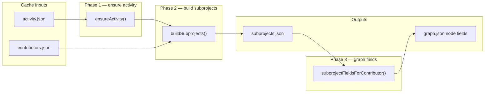
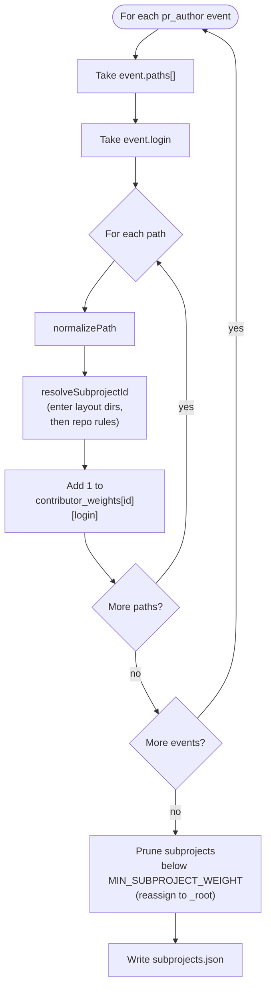
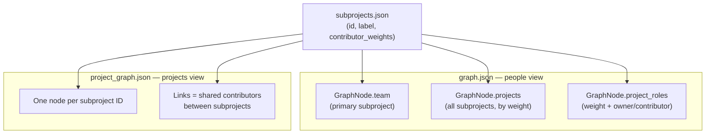

# Stage 3 — Subsystem / Subproject Component

## Scope

This plan covers **only** the D2 subproject pipeline (spec Stage 3, step 1): identification, weighting, cache output, and graph field derivation. Skills (D3), collaboration edges (D6), Louvain (D5), and `project_graph.json` link math are out of scope except where they **consume** `subprojects.json`.

**Document roles:** `[.cursor/spec.md](.cursor/spec.md)` stays the overall architecture (stages, decisions D1–D9, cache layout, high-level Stage 3 sketch). **This plan** is the saved implementation detail for the subprojects component — do not duplicate it back into `spec.md`.

**Primary input:** `[cache/<owner>_<repo>/activity.json](scraper/src/fetch/activity.ts)` (`pr_author` events with `paths[]`). `**activity.json` is always required** before subproject computation runs.

**PR labels and `GENERIC_LABELS`** (`[scraper/src/config.ts](scraper/src/config.ts)`) are **not** used for boundaries (D2).

---

## `activity.json` contract

`compute/` never reads `prs.json` / `reviews.json` directly for subproject logic. It always consumes a normalized `activity.json`.

**Normal path:** Stage 2 (`npm run scrape` → `enrichRepo`) writes `activity.json` alongside Stage 1 cache files.

**If `activity.json` is missing** (e.g. old cache dir, manual deletion, Stage 1-only scrape):

1. `compute/` reads `prs.json` + `reviews.json` from the same cache dir.
2. Calls `[buildActivity(prs, reviews)](scraper/src/fetch/activity.ts)` — same pure function Stage 2 uses.
3. **Writes** the result to `cache/<owner>_<repo>/activity.json` (regenerate, not an in-memory shortcut).
4. Proceeds with subproject build using the freshly written file.

If `prs.json` or `reviews.json` is also missing, fail fast with a clear error (“run scraper first”).

```ts
// compute/src/io/activity.ts
export function ensureActivity(cacheDir: string): ActivityData {
  const activityPath = join(cacheDir, "activity.json");
  if (existsSync(activityPath)) return readJson(activityPath);
  const prs = readJson(join(cacheDir, "prs.json"));
  const reviews = readJson(join(cacheDir, "reviews.json"));
  const activity = buildActivity(prs, reviews);
  writeJson(activityPath, activity);
  return activity;
}
```

This keeps a single source of truth for event shape and avoids duplicating flatten logic inside `compute/`.

---

## How subprojects are identified

Subprojects are **not discovered by clustering or manifests**. They are **deterministic buckets** derived from changed-file paths on PRs.

### End-to-end overview

Three phases, three artifacts:




| Phase | Reads                                         | Writes                       | Question it answers                                |
| ----- | --------------------------------------------- | ---------------------------- | -------------------------------------------------- |
| 1     | `activity.json` (or regenerates from Stage 1) | `activity.json` if missing   | Do we have a normalized event stream?              |
| 2     | `activity.json` + `contributors.json`         | `subprojects.json`           | Which directory areas exist, and who touched them? |
| 3     | `subprojects.json`                            | fields on `graph.json` nodes | What is each person's primary team / project list? |


### Worked example (one PR event)

This is the core identification logic — everything else is repetition + aggregation.

```
PR #4821  author: alice
paths: ["packages/react-dom/src/client.js", "src/server/handler.go", "README.md"]

Step A — normalize (string cleanup only)
  (unchanged)

Step B — resolve subproject ID
  packages/react-dom/src/client.js
    → nested_roots.packages = 2  →  packages/react-dom
    (inner src/ is never a subproject; depth stops at package name)

  src/server/handler.go
    → enter src/ (layout dir, not a project)  →  server/handler.go
    → default_depth = 1  →  server

  README.md
    → no slash  →  _root

Step C — weight (1 touch per distinct path per PR, deduped)
  contributor_weights["packages/react-dom"]["alice"] += 1
  contributor_weights["server"]["alice"] += 1
  contributor_weights["_root"]["alice"] += 1
```

After processing all `pr_author` events in the window, prune low-traffic buckets, then write `subprojects.json`.

### Phase 2 detail — per-event loop




**What is NOT in this loop:** review events (no paths), PR labels, manifest deps, line counts.

### Step 1 — Collect path evidence (authors only)

For each `ActivityEvent` where `kind === "pr_author"`:

- **Contributor:** `event.login`
- **Timestamp:** `event.at` (for optional recency; see weighting)
- **Paths:** each string in `event.paths` (from GitHub `filename`; repo-root-relative, forward slashes)

**Reviews do not assign subproject ownership in v1.** Reviewers affect collaboration edges (D6) but not `contributor_weights` in `subprojects.json`, because review events carry no paths and D2 is path-derived.

### Step 2 — Normalize paths

Pure string hygiene before segmentation:


| Rule                       | Example                                           |
| -------------------------- | ------------------------------------------------- |
| Strip leading `./`         | `./src/foo.ts` → `src/foo.ts`                     |
| Collapse duplicate slashes | `src//a.ts` → `src/a.ts`                          |
| Ignore empty paths         | skip                                              |
| Keep case as-is            | `Packages/Foo` stays distinct from `packages/foo` |


No repo clone; paths are exactly what Stage 1 cached.

### Step 3 — Map path → subproject ID

Resolution is two steps: **enter layout directories** (skip generic wrappers), then **take a path prefix** as the subproject ID.

#### 3a — Enter layout directories (not subprojects)

Some top-level folders are repo scaffolding, not meaningful project areas. **`enter_dirs`** lists segments to **skip** when they appear at the **front** of the path (after normalize). The resolver walks into them and continues with the remainder.

**Default `enter_dirs`** (global in `compute/src/config.ts`):

```
src, lib, internal
```

| Path (before enter) | After entering | Then ID (depth 1) |
| ------------------- | -------------- | ----------------- |
| `src/server/handler.go` | `server/handler.go` | `server` |
| `src/helper.ts` | `helper.ts` (lone file) | `_root` |
| `lib/core/foo.rs` | `core/foo.rs` | `core` |
| `cmd/redis/main.go` | (unchanged — `cmd` not in list) | `cmd` |
| `packages/react-dom/src/client.js` | (unchanged at this step — `packages` is not entered) | → 3b |

**Rules:**

- Only **leading** segments are entered, one at a time, until the first non-`enter_dir` segment or the path is exhausted.
- Entering applies **before** `nested_roots` / depth (see 3b).
- If entering consumes the entire path (e.g. `src/foo.ts` → lone file segment), map to `_root`.
- Per-repo rules may **add** extra enter dirs (e.g. `test`, `tests`); defaults always apply.

#### 3b — Take prefix as subproject ID

On the path **after** entering, subproject ID = first N segments, where N = `default_depth` unless the first segment matches `nested_roots`.

| Path (after enter) | Subproject ID |
| ------------------ | ------------- |
| `server/handler.go` | `server` |
| `react/foo.js` | `react` |
| `cmd/redis/main.go` | `cmd` |
| `README.md` | `_root` |
| `.github/workflows/ci.yml` | `.github` |

**Root-level files** (no `/` in original path) map to **`_root`**. Label: `"Repository root"`.

**Monorepo containers (`nested_roots`):** when the first segment *after entering* is a known container (e.g. `packages`, `pkg`), use deeper segmentation so package-level areas become subprojects.

Config shape (in [`compute/src/config.ts`](compute/src/config.ts)):

```ts
export const DEFAULT_ENTER_DIRS = ["src", "lib", "internal"];

export interface SubprojectRules {
  default_depth: number;                // 1
  root_bucket: string;                  // "_root"
  nested_roots: Record<string, number>; // first segment → depth after enter
  extra_enter_dirs?: string[];          // merged with DEFAULT_ENTER_DIRS
}

// Example: facebook/react
{
  default_depth: 1,
  root_bucket: "_root",
  nested_roots: { packages: 2 },
}
// packages/react-dom/src/client.js → enter (no-op) → depth 2 under packages/ → packages/react-dom

// Example: microsoft/vscode (src/ auto-entered globally)
{
  default_depth: 1,
  root_bucket: "_root",
  nested_roots: { vs: 2 },
}
// src/vs/workbench/file.ts → enter src → vs/workbench/file.ts → depth 2 under vs/ → vs/workbench
```

**Resolution algorithm:**

1. Split normalized path on `/`.
2. While `segments[0]` is in `enter_dirs` (defaults ∪ repo extras), shift it off. If none left → `_root`.
3. If one segment remains and it is a filename (contains `.`), → `_root`.
4. Let `depth = default_depth`. If `segments[0]` is in `nested_roots`, set `depth = nested_roots[segments[0]]`.
5. Subproject ID = `segments.slice(0, depth).join("/")`.
6. If path has fewer segments than `depth`, use all segments (e.g. `packages/foo` with depth 2 → `packages/foo`).

**Starter per-repo overrides** for demo `REPOS` ([`scraper/src/config.ts`](scraper/src/config.ts)):

| Repo | `nested_roots` | `extra_enter_dirs` | Rationale |
| ---- | -------------- | ------------------ | --------- |
| `facebook/react` | `{ packages: 2 }` | — | Lerna-style packages |
| `microsoft/vscode` | `{ vs: 2 }` | — | `src/` entered globally; areas under `vs/` |
| `kubernetes/kubernetes` | `{ pkg: 2, staging: 2 }` | — | Component packages under `pkg/` |
| `redis/redis` | `{}` | — | `src/modules/...` → enter `src` → module name |
| `rust-lang/rust` | `{}` | — | `compiler/`, `library/` stay at depth 1 |

Repos not in the map use `{ default_depth: 1, root_bucket: "_root", nested_roots: {} }` plus global `DEFAULT_ENTER_DIRS`.

**ID → label:** human label = subproject ID, except `_root` → `"Repository root"`. No slugification beyond using the path prefix as the ID (stable, debuggable).

### Step 4 — Weight contributor touches

For each `(login, path, at)` from Step 1–3:

```
touchWeight = 1   // v1: one unit per distinct path per PR event
```

Within a single `pr_author` event, **dedupe paths** before counting (same file listed once).

Optional v1.1 (document in spec, implement if trivial): multiply by `exp(-LAMBDA * days_since_at)` using shared `[LAMBDA](scraper/src/config.ts)` so recent work weighs more—same constant as D6 edges.

**Do not** use additions/deletions in v1 (keeps subprojects independent of PR size noise; line counts remain available in `prs.json` for future use).

Accumulate into:

```
contributorWeights[subprojectId][login] += touchWeight
subprojectTotals[subprojectId] += touchWeight
pathSamples[subprojectId].add(path)   // cap sample list when writing
```

Only include logins that pass `[filterActiveContributors](scraper/src/filters.ts)` (`MIN_ACTIVITY`) when writing **graph-facing** fields; the cache file may retain all humans for debugging, or filter consistently—**recommend filtering at write time** so `subprojects.json` matches graph nodes.

### Step 5 — Prune noise subprojects

Drop subprojects where `subprojectTotals[id] < MIN_SUBPROJECT_WEIGHT` (new constant in `compute/`, suggested **5** total touches across all contributors). Prevents one-off paths from becoming graph nodes.

Paths that map to pruned IDs are **reassigned to `_root`** or dropped from contributor totals—**recommend `_root`** so no touch is lost.

### Step 6 — Write `subprojects.json`

Extend the spec sketch with fields needed for UI and project graph:

```ts
// compute/src/types.ts
export interface SubprojectsData {
  version: 1;
  generated_at: string;
  rules: SubprojectRules;              // echo applied rules for reproducibility
  subprojects: Record<string, {
    label: string;
    total_weight: number;
    contributor_weights: Record<string, number>;
    sample_paths: string[];          // up to 10 exemplar paths
  }>;
}
```

Written to `cache/<owner>_<repo>/subprojects.json` by `compute/buildSubprojects()`.

---

## Downstream: how subprojects reach the graphs

`subprojects.json` is the single source of truth for directory-based "projects." Two published graphs consume it differently:




## Downstream: contributor graph fields

From `subprojects.json`, for each **active** contributor:


| Field           | Derivation                                                                                                                                                  |
| --------------- | ----------------------------------------------------------------------------------------------------------------------------------------------------------- |
| `team`          | Subproject ID with max `contributor_weights[login]`; tie-break: higher `total_weight`, then lexicographic ID                                                |
| `projects`      | All subproject IDs where weight > 0, sorted by weight desc                                                                                                  |
| `project_roles` | For each ID in `projects`: `{ weight, role }` where `role` is `"owner"` if weight ≥ 40% of that contributor’s total subproject weight, else `"contributor"` |


These populate existing `[GraphNode](scraper/src/types.ts)` fields when building `graph.json`.

---

## Downstream: project graph nodes (consumer only)

`project_graph.json` nodes = keys of `subprojects.json.subprojects` (after prune). Node `id` = subproject ID, `name` = `label`. Link weights between subprojects come from **shared contributors** (Stage 3 step 5—separate implementation pass).

---

## `compute/` module layout


| File                                                                                 | Responsibility                                                                                                                     |
| ------------------------------------------------------------------------------------ | ---------------------------------------------------------------------------------------------------------------------------------- |
| `[compute/package.json](compute/package.json)`                                       | New package; depends on shared types or copies minimal interfaces                                                                  |
| `[compute/src/config.ts](compute/src/config.ts)`                                     | `DEFAULT_ENTER_DIRS`, `SUBPROJECT_RULES_BY_REPO`, `MIN_SUBPROJECT_WEIGHT`, re-export `MIN_ACTIVITY`, `LAMBDA` |
| `[compute/src/types.ts](compute/src/types.ts)`                                       | `SubprojectsData`, `SubprojectRules`                                                                                               |
| `[compute/src/subprojects/normalize.ts](compute/src/subprojects/normalize.ts)`       | `normalizePath()`                                                                                                                  |
| `[compute/src/subprojects/resolve.ts](compute/src/subprojects/resolve.ts)`           | `resolveSubprojectId(path, rules)` — enter_dirs, then nested_roots depth |
| `[compute/src/subprojects/build.ts](compute/src/subprojects/build.ts)`               | `buildSubprojects(repo, activity, contributors)` → `SubprojectsData`                                                               |
| `[compute/src/subprojects/graph-fields.ts](compute/src/subprojects/graph-fields.ts)` | `subprojectFieldsForContributor(data, login)` → `{ team, projects, project_roles }`                                                |
| `[compute/src/io/activity.ts](compute/src/io/activity.ts)`                           | `ensureActivity(cacheDir)` — read or regenerate `activity.json` via `buildActivity`                                                |
| `[compute/src/io/cache.ts](compute/src/io/cache.ts)`                                 | Read/write `subprojects.json` and other compute artifacts                                                                          |
| `[compute/src/build.ts](compute/src/build.ts)`                                       | CLI orchestrator (subprojects first; skills/graphs later)                                                                          |


Shared types: prefer importing from `[scraper/src/types.ts](scraper/src/types.ts)` via TS path alias or a tiny `shared/` package—avoid drift on `ActivityEvent` / `GraphNode`.

**Configuration constants** (defined in `compute/src/config.ts`, not duplicated in `spec.md`):


| Constant                     | Suggested           | Purpose                                        |
| ---------------------------- | ------------------- | ---------------------------------------------- |
| `DEFAULT_ENTER_DIRS`         | `src`, `lib`, `internal` | Layout dirs to traverse, not subproject IDs |
| `MIN_SUBPROJECT_WEIGHT`      | 5                   | Min total touches to keep a subproject         |
| `SUBPROJECT_RULES_BY_REPO`   | per table in Step 3 | Monorepo depth overrides                       |
| `SUBPROJECT_OWNER_THRESHOLD` | 0.4                 | Fraction of personal weight for `"owner"` role |


---

## Verification

1. Run scrape on `redis/redis` (small): inspect `activity.json` paths → confirm `src/modules/...` maps to `modules`, not `src`.
2. Run `compute` on same cache: `subprojects.json` sample_paths should match intuition.
3. For `facebook/react`, confirm `packages/react-dom/...` maps to `packages/react-dom`, not bare `packages`.
4. For `microsoft/vscode`, confirm `src/vs/workbench/...` maps to `vs/workbench`, not `src`.
5. Unit tests (recommended): `normalizePath`, `resolveSubprojectId` with enter_dirs + fixture paths—no GitHub needed.

```bash
cd scraper && npm run scrape -- --repo redis/redis
cd compute && npm run build -- --repo redis/redis   # after package exists
```

---

## Non-goals (this component)

- PR label → subproject mapping
- Manifest / dependency graph for boundaries (manifests feed **skills**, not D2)
- Reviewer path inheritance from reviewed PRs
- Louvain clustering to **define** subprojects (Louvain applies to **contributor** communities only)
- v2 clone-based module detection

