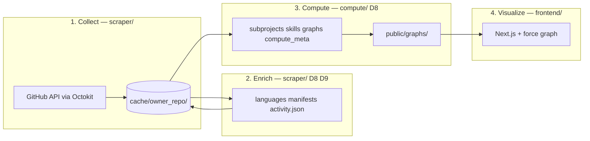

# Repository Map — Implementation Spec

**Status:** Draft  
**Product vision:** See [.cursor/research.md](research.md) (do not duplicate here; this file tracks *current* workflow and build decisions).  
**Legacy reference:** [CLAUDE.md](../CLAUDE.md) and [README.md](../README.md) still describe the original YHack “Hop Onboard” Slack + Python pipeline; that stack is **not** present on this branch.

### Resolved (architecture)

| ID | Choice | Summary |
|----|--------|---------|
| **D1** | **A+** | PRs + reviews + **changed files per PR** (via PR API). No issues, global commit crawl, or standalone commit files in v1. |
| **D2** | **Directory-based** | Subprojects = path-derived areas from PR changed files (not PR labels). |
| **D4** | **Two graph files** | `graph.json` (contributors) + `project_graph.json` (directory subprojects). **No** separate technology graph — skills live on each contributor node (**D3**). |
| **D7** | **`scraper/` + `compute/`** | Stages 1–2 in `scraper/`; Stage 3 graph build in `compute/`. |
| **D6** | **PR activity + shared paths** | Contributor edges strengthened by **shared PR participation** (author, reviewer, or both on the same PR) and **overlapping changed file paths** across PRs. Reviews remain a primary signal (`REVIEW_WEIGHT`). |
| **D3** | **Per-repo skills cache** | No global taxonomy. `compute/` derives **provisional signals** from PR evidence; the most frequent are promoted into a **canonical `skills.json` per repo**. Contributor nodes hold weighted skill refs. |
| **D9** | **GitHub API (v1)** | Stage 2 enrichment via **Languages API** + **PR changed paths** (cache) + **targeted manifest fetch** (Contents API). **No repo clone in v1.** Full/shallow clone + static analysis deferred to **v2**. |
| **D8** | **Per-repo cache artifacts** | All under `cache/<owner>_<repo>/`. **Stage 2 (`scraper/`):** `languages.json`, `manifests/`, `activity.json`. **Stage 3 (`compute/`):** `subprojects.json`, `skills.json`, `compute_meta.json`. Graphs publish to `frontend/public/graphs/`. |
| **D5** | **Out of v1** | No community detection (Louvain/Leiden) in v1. Contributor graphs omit community clustering. |
| **D10** | **v2 only** | No LLM in v1. K2 (or equivalent) for summaries, panel copy, and/or chat in **v2+**. |

---

## Current repository state

| Area | Status |
|------|--------|
| **Collect + enrich** (`scraper/`) | Stages 1–2 **complete** (`npm run scrape`). Writes Stage 1 cache + `languages.json`, `manifests/`, `activity.json` per repo. |
| **Compute** (`compute/`) | **Partial.** Subprojects (**D2**) and skills (**D3**) implemented (`npm run build`). Not yet: collaboration edges (**D6**), `graph.json` / `project_graph.json` publish, `compute_meta.json`. |
| **Cache / raw data** | Not in git; per-repo dir at `cache/<owner>_<repo>/` (see **Per-repo cache layout** below). |
| **Frontend** (`frontend/`) | Shell UI: layout, theme toggle, header logo. Graph components, chat API, and D3 removed. |
| **Graph assets** | No committed `frontend/public/graphs/<repo>/graph.json` + `project_graph.json` on this branch. |
| **Env** | Root `.env.example`: `GITHUB_TOKEN`, `K2_API_KEY` (`K2_API_KEY` for **v2** LLM only; unused in v1). |

---

## Target workflow (as designed)

End-to-end flow aligned with [research.md](research.md), constrained by resolved architecture choices above.



### Stage 1 — GitHub data collection (**complete**)

**Goal:** Normalized per-repo activity for contributors, PRs, reviews, and per-PR file changes (**D1: A+**).

**In scope (v1)**

- Pull request metadata, authors, labels (metadata only; not used for subprojects per **D2**)
- Reviews on those PRs
- **Changed files** on each PR (`GET /repos/{owner}/{repo}/pulls/{pull_number}/files`)

**Out of scope (v1)**

- Issues, issue comments, assignees
- Repository-wide commit history / co-author mining
- Local repo clone (**v2** per **D9**; not used in v1 collect or compute)

**Inputs**

- `GITHUB_TOKEN` (root `.env`)
- Repo list: `scraper/src/config.ts` → `REPOS`
- Time window: `WINDOW_MONTHS` (6 months) — computed by `scraper/src/window.ts` `getWindowStart()`

**Implemented API surface (Octokit)**

| Entity | Type | Implementation |
|--------|------|----------------|
| Pull requests | `RawPR`: number, title, author, created_at, labels, `files: PRFileChange[]` | `scraper/src/fetch/prs.ts` `fetchPRs()` — paginates `pulls.list` with early stop at `windowStart`, concurrent files+reviews fetch per PR |
| Changed files | `PRFileChange`: path, additions, deletions | `pulls.listFiles` — GitHub `filename` field mapped to `path` |
| Reviews | `RawReview`: pr_number, reviewer, submitted_at | `pulls.listReviews` — `DISMISSED` and bot reviews excluded |
| Contributors | `ContributorStat`: login, name, avatar_url, total | `scraper/src/fetch/contributors.ts` `fetchContributors()` — activity counts from PRs+reviews, profiles via `users.getByUsername` |

**Deferred from research.md Stage 1:** issues, standalone commits, PR-linked issue cross-refs.

**Filtering**

- Bots: `KNOWN_BOTS` + `[bot]` suffix — `scraper/src/filters.ts` `isBot()`
- Active contributors: combined PR + review count ≥ `MIN_ACTIVITY` — `filterActiveContributors()` (applied by `compute/` at graph build time; all window humans stored in `contributors.json`)

**Cache outputs (Stage 1 only)** — written by `scraper/src/cache.ts` `writeCache()`:

| File | Content |
|------|---------|
| `prs.json` | `RawPR[]` — each entry includes `files: PRFileChange[]` |
| `reviews.json` | `RawReview[]` |
| `contributors.json` | `ContributorStat[]` — all human window participants, sorted by activity desc |
| `meta.json` | `CacheMeta` — `scraped_at`, `window_start`, `pr_count`, `review_count` |

See **Per-repo cache layout** for Stage 2–3 artifacts in the same directory.

**Key implementation files**

| File | Role |
|------|------|
| `scraper/src/types.ts` | `PRFileChange`, `RawPR` (with `files`), `RawReview`, `ContributorStat`, `CacheMeta` |
| `scraper/src/config.ts` | `REPOS`, `WINDOW_MONTHS`, `MIN_ACTIVITY`, `LAMBDA`, `REVIEW_WEIGHT`, `KNOWN_BOTS` |
| `scraper/src/filters.ts` | `isBot()`, `filterActiveContributors()` |
| `scraper/src/paths.ts` | `repoToCacheDir()` — maps `"owner/repo"` → repo-root `cache/owner_repo/` |
| `scraper/src/window.ts` | `getWindowStart()` — returns `Date` for `now - WINDOW_MONTHS` |
| `scraper/src/github.ts` | `createOctokit()` — loads `GITHUB_TOKEN` from root `.env`, fails fast if missing |
| `scraper/src/cache.ts` | `writeCache()` — `mkdir -p` + writes all four JSON files |
| `scraper/src/fetch/prs.ts` | `fetchPRs()` — PR list with early stop, concurrent files+reviews per PR, returns `prs` + `reviewPairs` |
| `scraper/src/fetch/contributors.ts` | `fetchContributors()` — activity counts → profiles via `users.getByUsername` |
| `scraper/src/scrape.ts` | CLI entrypoint — `--repo owner/name` or all `REPOS`; Stage 1 collect + Stage 2 enrich per repo |

**Status:** Complete.

---

### Stage 2 — Repository enrichment (**D8**, **D9**, **complete**)

**Owner:** `scraper/` (same package as Stage 1; runs after collect for each repo).

**Goal:** API enrichment and a **normalized activity stream** in the per-repo cache, so `compute/` can rebuild graphs without re-parsing raw PR blobs or re-hitting GitHub for unchanged inputs.

**Inputs:** Stage 1 files in `cache/<owner>_<repo>/` (`prs.json`, `reviews.json`, `meta.json`).

**GitHub API enrichment (D9 v1)**

| Source | API | Cache output |
|--------|-----|----------------|
| Repository languages | `GET /repos/{owner}/{repo}/languages` | `languages.json` — Linguist language → byte counts (1 call/repo) |
| Manifests | `GET /repos/{owner}/{repo}/contents/{path}?ref={ref}` | `manifests/<path-key>.json` — parsed deps per manifest file |

**Manifest fetch (light):** root allowlist (`package.json`, `go.mod`, `Cargo.toml`, …) plus any manifest paths seen in PR `files`. Default `ref`: default branch.

**Normalized activity (`activity.json`)**

Flatten `prs.json` + `reviews.json` into a single event list for downstream stages:

```ts
// activity.json
{
  version: number
  generated_at: string
  events: Array<
    | { kind: "pr_author"; login: string; pr: number; at: string; paths: string[]; title: string }
    | { kind: "review"; login: string; pr: number; author: string; at: string }
  >
}
```

Used by `compute/` for collaboration edges (**D6**), directory subprojects (**D2**), and provisional skill extraction (**D3**). Skills v1 reads `pr_author.paths[]` only — not `pr_author.title` (PR titles deferred to subproject v2).

**Stage 2 cache outputs**

| File | Writer |
|------|--------|
| `languages.json` | `scraper/` |
| `manifests/*.json` | `scraper/` |
| `activity.json` | `scraper/` |

**Key implementation files**

| File | Role |
|------|------|
| `scraper/src/fetch/activity.ts` | `buildActivity(prs, reviews)` — pure flatten to `ActivityData` |
| `scraper/src/fetch/languages.ts` | `fetchLanguages()` — one Languages API call per repo |
| `scraper/src/fetch/manifests.ts` | `fetchManifests()` — root allowlist ∪ PR paths; parses deps |
| `scraper/src/fetch/enrich.ts` | `enrichRepo()` — coordinator; writes Stage 2 cache |
| `scraper/src/cache.ts` | `writeEnrichCache()` — writes `languages.json`, `manifests/`, `activity.json` |
| `scraper/src/scrape.ts` | Calls `enrichRepo()` after `writeCache()` on each scrape |

**Does not do in v1:** full recursive tree walk, import/AST analysis, git history.

**v2 additions (deferred):**

- Repo clone (**D9**) — shallow/sparse clone for import parsing and deeper framework detection.
- LLM summaries / chat (**D10**) — optional narratives keyed to graph + `skills.json`.
- Community detection (**D5**) — Louvain or similar on contributor edges.
- PR title tokens for **subproject** detection/labeling (not skills).

**Status:** Complete. Runs automatically as part of `npm run scrape`.

---

### Stage 3 — Knowledge graph computation (**partial**)

**Owner:** `compute/` package (**D7**).

**Inputs:** `cache/<owner>_<repo>/` — primarily `activity.json`, `contributors.json`, `languages.json`, `manifests/`, `meta.json` (**D8**). Raw `prs.json` / `reviews.json` are fallback if `activity.json` is missing (`ensureActivity()` regenerates it via `buildActivity()`).

**Goal:** Directory subprojects, per-repo skill registry, contributor + project graphs, and compute bookkeeping.

**Stage 3 cache outputs (before publish)**

| File | Purpose | Status |
|------|---------|--------|
| `subprojects.json` | Directory subproject map + per-contributor weights (**D2**) | **Implemented** |
| `skills.json` | Per-repo canonical skill registry (**D3**) | **Implemented** |
| `compute_meta.json` | Input fingerprints, stage timestamps, schema versions (**D8**) | Planned |

**Algorithm (v1)**

1. **Subsystems (“projects”) — directory-based (D2)** — **Implemented.** Read `activity.json` `pr_author` events.  
   - Map each path → **subproject ID** (default: first path segment; monorepo depth overrides in `compute/src/config.ts` → `SUBPROJECT_RULES_BY_REPO`).  
   - Skip layout-only segments (`src`, `lib`, `internal`, …) via `enter_dirs` traversal.  
   - Aggregate contributor touch weights per subproject; prune buckets below `MIN_SUBPROJECT_WEIGHT`.  
   - **Write** `subprojects.json`: subproject IDs, labels, `contributor_weights`, `sample_paths`, applied `rules`.  
   - **Graph fields:** `GraphNode.team`, `projects`, `project_roles` via `subprojectFieldsForContributor()` (consumed when building `graph.json`).  
   - `GENERIC_LABELS` is **not** used for subproject boundaries.

2. **Contributor skills (D3)** — **Implemented.** Extract provisional signals from `activity.json` (`pr_author.paths[]` only), `manifests/`, and `languages.json`.  
   - **Three extractors:** file extensions → `lang:*`; path segments → `path:*` (excludes subproject IDs); manifest deps → `dep:*` (longest manifest-prefix match per path).  
   - **Not used:** PR title tokens (`pr_author.title`) — deferred to subproject v2.  
   - Count repo-wide; promote frequent signals into **`skills.json`** (`id`, `label`, optional `kind`).  
   - `kind` is uniform per ID prefix: `lang:` → `"language"`, `dep:` → `"dependency"`, `path:` → omitted.  
   - Assign each active contributor `skills: { id, weight }[]` in memory via `assignContributorSkills()` (top `MAX_CONTRIBUTOR_SKILLS`); written to `graph.json` in a later pass.  
   - Repo-wide `languages.json` entries promoted without fabricating per-contributor weights.  
   - v1 stays fully deterministic (no LLM — **D10**).

3. **Collaboration edges (D6)** — **Not implemented.** From `activity.json`, for each contributor pair *(A, B)*, accumulate edge weight from:
   - **Shared PR activity** — Same PR with both participating (roles: author, reviewer). Reviewer↔author on a PR adds `REVIEW_WEIGHT` (1.0) per review event; additional co-presence on a PR (e.g. multiple reviewers, or repeat interaction on the same PR) adds to the same edge bucket.
   - **Shared changed paths** — For file paths each person touched (via their PRs’ `files`), add weight proportional to overlap (e.g. Jaccard or count of shared paths, scaled by recency and touch volume). Same path on the same PR counts under both signals; dedupe or cap in `compute/` implementation.
   - **Recency** — Each event at time *t* contributes `base * exp(-LAMBDA * days_since_t)` with `LAMBDA = 0.005`.
   - **Out of scope for edges:** issue comments, co-authored commits off-PR (**D1**).

4. **Project graph** — **Not implemented.** Nodes = directory subproject IDs from `subprojects.json`; edges = shared contributors. Same keys as `GraphNode.projects`.

5. **`compute_meta.json`** — **Not implemented.** Written last; records input timestamps (`meta.scraped_at`, `activity.json` generation time) and output timestamps so `compute/` can skip rework when the cache is unchanged.

**Out of v1:** community detection / Louvain (**D5**). `GraphNode.community` omitted or unused in v1 `graph.json`.

**Stage 3 cache schemas**

```ts
// subprojects.json
{
  version: 1
  generated_at: string
  rules: SubprojectRules
  subprojects: Record<string, {
    label: string
    total_weight: number
    contributor_weights: Record<string, number>
    sample_paths: string[]
  }>
}

// skills.json — see also GraphNode.skills below
{
  version: 1
  updated_at: string
  skills: Record<string, { label: string; kind?: string }>
  // kind: "language" | "dependency" | omitted for path:*
}

// compute_meta.json (planned)
{
  compute_version: number
  generated_at: string
  inputs: { meta_scraped_at: string; activity_generated_at: string; pr_count: number }
  outputs: { subprojects_at: string; skills_at: string; graphs_at: string }
}
```

**Key implementation files**

| File | Role |
|------|------|
| `compute/src/build.ts` | CLI — `ensureActivity()` → subprojects → skills |
| `compute/src/io/activity.ts` | `ensureActivity()` — read or regenerate `activity.json` |
| `compute/src/io/cache.ts` | Read/write cache artifacts (`subprojects.json`, `skills.json`, …) |
| `compute/src/config.ts` | Subproject rules, skill promotion thresholds, `EXT_TO_LANGUAGE` |
| `compute/src/types.ts` | `SubprojectsData`, `SkillsData`, `SkillRef`, graph field types |
| `compute/src/subprojects/` | `buildSubprojects()`, path→ID resolution, `subprojectFieldsForContributor()` |
| `compute/src/skills/` | `extractSignalHits()`, `buildSkills()`, `assignContributorSkills()` |

**Published output (per repo in `REPOS`)** — not yet written by `compute/`

```
frontend/public/graphs/<owner>_<repo>/
  graph.json           # contributor GraphData
  project_graph.json   # project GraphData (subproject nodes + links)
```

**Contributor graph (`graph.json`)** — extend `scraper/src/types.ts` (or shared types used by `compute/`):

```ts
GraphData {
  repo: string
  generated_at: string
  nodes: GraphNode[]   // contributors
  links: GraphLink[]   // collaboration
}

GraphNode {
  // ...existing fields...
  skills: SkillRef[]   // { id, weight } — id keys into cache/.../skills.json
}
```

**Project graph (`project_graph.json`)** — define in `compute/` (TBD): subproject nodes (id, label, aggregated skill IDs from member contributors), links weighted by shared membership.

Frontend loads `graph.json` + `skills.json` (or skills embedded in graph metadata) for people vs project views; technology discovery filters/aggregates skills by `kind`.

**Status:** Subprojects (**D2**) and skills registry (**D3**) complete. Collaboration edges (**D6**), graph publish, and `compute_meta.json` remain.

---

### Stage 4 — Frontend visualization (partial)

**Goal:** Interactive exploration per [research.md](research.md): contributor view (`graph.json`), project view (`project_graph.json`), technology discovery via per-person `skills` + per-repo `skills.json` (not a separate graph).

**Current UI**

- `app/page.tsx` — full-height layout: `AppHeader` + empty `MainArea`
- `AppHeader.tsx` — logo, dark/light toggle (`ThemeContext`)
- Dependencies: Next.js 16, React 19, Tailwind 4 — **no** D3, graphology, or OpenAI client

**Removed (not on branch)** — To be reimplemented or replaced: `OrgGraph`, `ProjectGraph`, graph panels, search, view switcher, `api/chat/route.ts`.

**Status:** Shell only.

---

## Data flow summary

| Stage | Input | Output | Owner |
|-------|--------|--------|--------|
| 1 Collect | GitHub API | `prs.json`, `reviews.json`, `contributors.json`, `meta.json` | `scraper/` |
| 2 Enrich | Stage 1 cache + Languages/Contents API (**D9**) | `languages.json`, `manifests/`, `activity.json` | `scraper/` |
| 3 Compute | Stage 1–2 cache (**D8**) | `subprojects.json`, `skills.json` *(done)*; `compute_meta.json`, `public/graphs/.../graph.json`, `project_graph.json` *(planned)* | `compute/` |
| 4 Visualize | `public/graphs/` | Browser UI | `frontend/` |

---

## Per-repo cache layout (`cache/<owner>_<repo>/`)

All pipeline artifacts for one repository live in a **single dedicated directory**. Not committed (`cache/` in root `.gitignore`).

```
cache/<owner>_<repo>/
  # Stage 1 — scraper/
  meta.json
  prs.json
  reviews.json
  contributors.json

  # Stage 2 — scraper/ (D8, D9)
  languages.json
  manifests/
  activity.json

  # Stage 3 — compute/ (D8, D2, D3)
  subprojects.json
  skills.json
  compute_meta.json
```

**Published graphs** (not under `cache/`):

```
frontend/public/graphs/<owner>_<repo>/
  graph.json
  project_graph.json
```

Re-running **`scraper/`** (new scrape) invalidates Stage 2–3 cache files for that repo. Re-running **`compute/`** refreshes `subprojects.json`, `skills.json`, `compute_meta.json`, and published graphs from the current cache.

---

## Configuration reference

| Constant | Value | Location | Purpose |
|----------|-------|----------|---------|
| `REPOS` | 5 OSS repos (react, vscode, redis, k8s, rust) | `scraper/src/config.ts` | Demo / dev targets |
| `WINDOW_MONTHS` | 6 | `scraper/src/config.ts` | Activity window |
| `MIN_ACTIVITY` | 3 | `scraper/` + `compute/` | Min PR+review actions for a graph node |
| `LAMBDA` | 0.005 | `scraper/` + `compute/` | Per-day recency decay on edges (reserved) |
| `REVIEW_WEIGHT` | 1.0 | `scraper/src/config.ts` | Per-review contribution within shared-PR activity (**D6**) |
| `CO_COMMENT_WEIGHT` | 0.3 | `scraper/src/config.ts` | Reserved; issues out of v1 ingestion scope |
| `MIN_SUBPROJECT_WEIGHT` | 5 | `compute/src/config.ts` | Min total path touches to keep a subproject bucket |
| `SUBPROJECT_OWNER_THRESHOLD` | 0.4 | `compute/src/config.ts` | Fraction of personal weight for `"owner"` role |
| `MIN_SKILL_REPO_COUNT` | 3 | `compute/src/config.ts` | Min repo-wide hits to promote a skill |
| `MIN_SKILL_CONTRIBUTORS` | 2 | `compute/src/config.ts` | Min distinct contributors (waived for `languages.json`-only langs) |
| `MAX_CANONICAL_SKILLS` | 150 | `compute/src/config.ts` | Cap on `skills.json` registry size |
| `MIN_DEP_HITS` | 2 | `compute/src/config.ts` | Min hits to promote a manifest dep |
| `MAX_CONTRIBUTOR_SKILLS` | 20 | `compute/src/config.ts` | Max skills per contributor node |
| *(TBD in `compute/`)* | — | — | Multiplier for shared changed-path overlap (**D6**) |
| `GENERIC_LABELS` | (set in config) | `scraper/src/config.ts` | Not used for directory subprojects or skills |

---

## Commands (today)

```bash
# Frontend shell
cd frontend && npm install && npm run dev

# Collect + enrich — Stages 1–2 (requires GITHUB_TOKEN)
cp .env.example .env          # add real GITHUB_TOKEN
cd scraper && npm install
npm run scrape -- --repo redis/redis   # single repo (dev)
npm run scrape                         # all REPOS
npm run typecheck                      # tsc --noEmit

# Compute — Stage 3 partial (subprojects + skills; no graph publish yet)
cd compute && npm install
npm run build -- --repo redis/redis    # single repo
npm run build                          # all REPOS
npm run typecheck

# Full pipeline (single repo)
cd scraper && npm run scrape -- --repo redis/redis
cd ../compute && npm run build -- --repo redis/redis
# Inspect cache/redis_redis/subprojects.json and skills.json
```

---

# Architectural decisions to make

Open items only. Resolved choices (D1–D10) are documented in **Resolved (architecture)** and in the workflow sections above.

---

## D11 — Frontend graph stack

**Question:** How is the force-directed graph rendered?

| Option | Notes |
|--------|--------|
| **D3 (prior art)** | Previous implementation removed; team knows it |
| **React wrapper** | e.g. react-force-graph, vis-network |
| **WebGL / large-graph lib** | If OSS repos produce huge node counts |

**Blocks:** Component architecture, performance tuning, migration effort.

---

## D12 — Multi-repo UX

**Question:** How does the user pick a repository?

| Option | Notes |
|--------|--------|
| **Build-time** | One repo per deployment |
| **URL param** | `/repo/facebook/react` |
| **In-app selector** | Dropdown over `REPOS` or user input |
| **Arbitrary GitHub URL** | Requires token + on-demand pipeline |

**Blocks:** Routing, static asset paths, whether compute is online or offline.

---

## D13 — Data delivery to the browser

**Question:** How does the frontend get graph data?

| Option | Notes |
|--------|--------|
| **Static JSON in `public/graphs/`** | Precomputed demo; simple hosting |
| **Next.js API route** | Read cache or graph at request time |
| **External store** | DB or object storage for production |

**Blocks:** Hosting model, refresh story, private repos.

---

## D14 — Authentication and private repos

**Question:** Who supplies `GITHUB_TOKEN`?

| Option | Notes |
|--------|--------|
| **Developer-only** | CLI scrape of public repos |
| **Server-side secret** | Single org token for demo |
| **User OAuth** | Per-user private repo access |

**Blocks:** Security model, deployment, scraper entrypoint design.

---

## D15 — Incremental updates

**Question:** After initial scrape, how is data refreshed?

| Option | Notes |
|--------|--------|
| **Full re-scrape** | Simplest |
| **Incremental** | Since-last-run cursors; harder with GitHub rate limits |

**Blocks:** Cache schema versioning, CI scheduling.

---

## D16 — Documentation drift

**Question:** When to rewrite `CLAUDE.md` / `README.md`?

Should happen once v1 pipeline and open frontend/delivery choices stabilize.

**Blocks:** Contributor onboarding only (not runtime).

---

## Suggested decision order

1. ~~Implement **Stage 2** in `scraper/`~~ — **done**  
2. ~~Implement **`compute/`** subprojects + skills~~ — **done**; remaining Stage 3: edges (**D6**), graphs, `compute_meta.json`  
3. **D11**–**D13** (frontend) once sample graphs exist  
4. **D14**–**D15** (auth, incremental) before production / private repos  
5. **D16** — refresh `CLAUDE.md` / `README.md` when v1 stabilizes  
6. **v2** — repo clone (**D9**), LLM (**D10**), communities (**D5**), PR titles for subprojects
