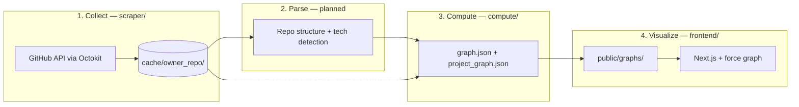

# Repository Map — Implementation Spec

**Status:** Draft  
**Product vision:** See [.cursor/research.md](research.md) (do not duplicate here; this file tracks *current* workflow and build decisions).  
**Legacy reference:** [CLAUDE.md](../CLAUDE.md) and [README.md](../README.md) still describe the original YHack “Hop Onboard” Slack + Python pipeline; that stack is **not** present on this branch.

### Resolved (architecture)

| ID | Choice | Summary |
|----|--------|---------|
| **D1** | **A+** | PRs + reviews + **changed files per PR** (via PR API). No issues, global commit crawl, or standalone commit files in v1. |
| **D2** | **Directory-based** | Subprojects = path-derived areas from PR changed files (not PR labels). |
| **D4** | **Two graph files** | `graph.json` (contributors) + `project_graph.json` (directory subprojects). **No** separate technology graph — languages/frameworks/tools live on each contributor node. |
| **D7** | **`scraper/` + `compute/`** | Collect in `scraper/`; graph build in `compute/` (separate package). |
| **D6** | **PR activity + shared paths** | Contributor edges strengthened by **shared PR participation** (author, reviewer, or both on the same PR) and **overlapping changed file paths** across PRs. Reviews remain a primary signal (`REVIEW_WEIGHT`). |

---

## Current repository state

| Area | Status |
|------|--------|
| **Collect** (`scraper/`) | Skeleton: config, types, bot/activity filters. No fetch entrypoints or npm scripts. |
| **Compute** (`compute/`) | Not created yet. Will read `cache/`, write graph JSON to `frontend/public/graphs/`. |
| **Cache / raw data** | Not in git; intended layout described below. |
| **Frontend** (`frontend/`) | Shell UI: layout, theme toggle, header logo. Graph components, chat API, and D3 removed. |
| **Graph assets** | No committed `frontend/public/graphs/<repo>/graph.json` + `project_graph.json` on this branch. |
| **Env** | Root `.env.example`: `GITHUB_TOKEN`, `K2_API_KEY` (K2 unused by current code). |

---

## Target workflow (as designed)

End-to-end flow aligned with [research.md](research.md), constrained by resolved architecture choices above.



### Stage 1 — GitHub data collection (planned)

**Goal:** Normalized per-repo activity for contributors, PRs, reviews, and per-PR file changes (**D1: A+**).

**In scope (v1)**

- Pull request metadata, authors, labels (metadata only; not used for subprojects per **D2**)
- Reviews on those PRs
- **Changed files** on each PR (`GET /repos/{owner}/{repo}/pulls/{pull_number}/files` or equivalent)

**Out of scope (v1)**

- Issues, issue comments, assignees
- Repository-wide commit history / co-author mining
- Local repo clone at collect time

**Inputs**

- `GITHUB_TOKEN` (root `.env`)
- Repo list: `scraper/src/config.ts` → `REPOS`
- Time window: `WINDOW_MONTHS` (6 months)

**Planned API surface (Octokit)**

| Entity | Fields (target) | Notes |
|--------|-----------------|--------|
| Pull requests | `RawPR`: number, title, author, created_at, labels, **`files: { path, additions, deletions }[]`** | Labels kept for optional display; **D2** uses `files` only |
| Reviews | `RawReview`: pr_number, reviewer, submitted_at | PR participation + review edges (**D6**) |
| Contributors | `ContributorStat`: login, name, avatar_url | Profile + avatar for nodes; commit count optional |

**Deferred from research.md Stage 1:** issues, standalone commits, PR-linked issue cross-refs.

**Filtering (implemented)**

- Bots: `KNOWN_BOTS` + `[bot]` suffix (`filters.isBot`)
- Active contributors: combined PR + review count ≥ `MIN_ACTIVITY` (`filterActiveContributors`)

**Intended cache layout (not yet written by code)**

```
cache/<owner>_<repo>/
  prs.json          # includes per-PR changed file paths
  reviews.json
  contributors.json # optional; may be folded into compute from PR/review authors
```

Local-only; not committed (see `.gitignore` patterns).

**Status:** Not started (no fetch scripts). Extend `scraper/src/types.ts` `RawPR` with `files` before implement.

---

### Stage 2 — Repository parsing (planned)

**Goal:** Enrich per-contributor `technologies` and project tech summaries (not a separate graph file).

**Research scope:** File paths from PRs, dependency manifests, imports, directory structure.

**Status:** Not implemented. May start as path/extension heuristics inside `compute/` before a dedicated parse step.

---

### Stage 3 — Knowledge graph computation (planned)

**Owner:** `compute/` package (**D7**). Reads `cache/<owner>_<repo>/`, writes two JSON files per repo (**D4**).

**Goal:** Contributor + project graphs with directory-based subprojects, per-person technology properties, expertise, and collaboration edges.

**Algorithm (v1; not coded)**

1. **Subsystems (“projects”) — directory-based**  
   - For each PR, map every changed file path → a **subproject ID** (canonical directory key).  
   - Default rule (until repo-specific tuning): use the **first meaningful path segment** after the repo root (e.g. `packages/react-reconciler/...` → `packages/react-reconciler`; `src/...` → `src`). Monorepos may need an allowlist of roots (`packages/*`, `cmd/`, etc.) — document per target repo in `compute/` config when needed.  
   - Contributor touch weight on subproject *S*: sum over their PRs of (lines changed or file-count) in paths mapped to *S*.  
   - `GraphNode.team` = highest-weight subproject; `projects` = ordered subproject IDs; `project_roles` = normalized weights + role string (e.g. `lead` / `core` / `contributor` by weight quantiles — TBD in compute).  
   - `GENERIC_LABELS` in scraper config is **not** used for subproject boundaries; labels remain on `RawPR` for optional UI only.

2. **Contributor nodes** — One node per active GitHub login.  
   - `expertise` = TF-IDF keywords from PR titles (v1 heuristic; **D3** open).  
   - **`technologies`** = structured list on the person (e.g. languages, frameworks, tools inferred from changed-file extensions, paths, and Stage 2 when available). Powers the “technology” exploration UI without a third graph file.

3. **Collaboration edges (D6)** — For each contributor pair *(A, B)*, accumulate edge weight from:
   - **Shared PR activity** — Same PR with both participating (roles: author, reviewer). Reviewer↔author on a PR adds `REVIEW_WEIGHT` (1.0) per review event; additional co-presence on a PR (e.g. multiple reviewers, or repeat interaction on the same PR) adds to the same edge bucket.
   - **Shared changed paths** — For file paths each person touched (via their PRs’ `files`), add weight proportional to overlap (e.g. Jaccard or count of shared paths, scaled by recency and touch volume). Same path on the same PR counts under both signals; dedupe or cap in `compute/` implementation.
   - **Recency** — Each event at time *t* contributes `base * exp(-LAMBDA * days_since_t)` with `LAMBDA = 0.005`.
   - **Out of scope for edges:** issue comments, co-authored commits off-PR (**D1**).

4. **Communities** — Louvain on the contributor graph (**D5** open; move `graphology` deps to `compute/`).

5. **Project graph** — Nodes = directory subproject IDs; edges = shared contributors (and/or dependency hints later). Same keys as `GraphNode.projects`.

**Output artifacts (per repo in `REPOS`)**

```
frontend/public/graphs/<owner>_<repo>/
  graph.json           # contributor GraphData
  project_graph.json   # project GraphData (subproject nodes + links)
```

**Contributor graph (`graph.json`)** — extend `scraper/src/types.ts` (or shared types used by `compute/`):

```ts
GraphData {
  repo: string
  generated_at: string
  nodes: GraphNode[]   // contributors
  links: GraphLink[]   // collaboration
}

GraphNode {
  // ...existing fields...
  technologies: TechnologyRef[]  // e.g. { id, kind: 'language' | 'framework' | 'tool', weight? }
}
```

**Project graph (`project_graph.json`)** — define in `compute/` (TBD): subproject nodes (id, label, tech stack summary), links weighted by shared membership.

Frontend loads both files for people vs project views; technology discovery filters/aggregates `nodes[].technologies`.

**Status:** Contributor types in `scraper/`; `compute/` package and project graph types not created.

---

### Stage 4 — Frontend visualization (partial)

**Goal:** Interactive exploration per [research.md](research.md): contributor view (`graph.json`), project view (`project_graph.json`), technology discovery via per-person `technologies` (not a separate graph).

**Current UI**

- `app/page.tsx` — full-height layout: `AppHeader` + empty `MainArea`
- `AppHeader.tsx` — logo, dark/light toggle (`ThemeContext`)
- Dependencies: Next.js 16, React 19, Tailwind 4 — **no** D3, graphology, or OpenAI client

**Removed (not on branch)** — To be reimplemented or replaced: `OrgGraph`, `ProjectGraph`, graph panels, search, view switcher, `api/chat/route.ts`.

**Status:** Shell only.

---

## Data flow summary

| Stage | Input | Output | Owner |
|-------|--------|--------|--------|
| Collect | GitHub API | `cache/*/` raw JSON | `scraper/` |
| Parse | Cache + repo tree | Tech signals for `technologies` on nodes | TBD (may live in `compute/` initially) |
| Compute | Cache (+ parse) | `graph.json` + `project_graph.json` | `compute/` |
| Visualize | Static JSON in `public/graphs/` | Browser UI | `frontend/` |

---

## Configuration reference

| Constant | Value | Purpose |
|----------|-------|---------|
| `REPOS` | 5 OSS repos (react, vscode, redis, k8s, rust) | Demo / dev targets |
| `WINDOW_MONTHS` | 6 | Activity window |
| `MIN_ACTIVITY` | 3 | Min PR+review actions for a node |
| `LAMBDA` | 0.005 | Per-day recency decay on edges |
| `REVIEW_WEIGHT` | 1.0 | Per-review contribution within shared-PR activity (**D6**) |
| `CO_COMMENT_WEIGHT` | 0.3 | Reserved; issues out of v1 ingestion scope |
| *(TBD in `compute/`)* | — | Multiplier for shared changed-path overlap (**D6**) |
| `GENERIC_LABELS` | (set in config) | Not used for directory subprojects; may be removed or repurposed later |

---

## Commands (today)

```bash
# Frontend shell
cd frontend && npm install && npm run dev

# Collect — no scripts defined yet
cd scraper && npm install

# Compute — package not created yet
# cd compute && npm install && npm run build
```

---

# Architectural decisions to make

Open items only. Resolved choices (D1, D2, D4, D6, D7) are documented in **Resolved (architecture)** and in the workflow sections above.

---

## D3 — Skill / expertise representation

**Question:** How are contributor skills stored?

| Option | Notes |
|--------|--------|
| **TF-IDF on PR titles** | Declared in `GraphNode.expertise` comment |
| **Structured taxonomy** | Languages, frameworks as typed entities (research.md) |
| **LLM summaries** | Old Hop Onboard pattern; contradicts “no commit LLM” unless aggregated-only |
| **Hybrid** | Heuristics for graph; optional LLM for panel copy |

**Blocks:** Node schema, whether Stage 2 parse is mandatory for v1.

---

## D5 — Community detection library

**Question:** Which algorithm packages communities on contributor nodes?

| Option | Notes |
|--------|--------|
| **Louvain** | Planned for `compute/` (`graphology-communities-louvain`; currently listed under `scraper/package.json`) |
| **Leiden** | Used in legacy Python (`leidenalg`); not in current deps |

**Blocks:** Dependency choice; parity with any published comparison docs.

---

## D8 — Intermediate schemas

**Question:** Are normalized artifacts required between cache and graph JSON?

Examples: unified “activity event” stream, per-PR file lists, **path segment → subproject ID** map versioned per repo.

**Blocks:** Ability to re-run compute without re-fetching; debugging and tests.

---

## D9 — Repository parsing depth (Stage 2)

**Question:** Is local clone + static analysis in scope for v1?

| Option | Notes |
|--------|--------|
| **Skip** | Directory subprojects from PR paths only (**D1** + **D2**) |
| **GitHub API tree** | Languages endpoint + paths from PR files + light manifest read |
| **Full clone** | Manifests, imports, framework detection per research.md |

**Blocks:** Rich `technologies` on contributor nodes (D3), timeline.

---

## D10 — LLM usage

**Question:** Is K2 (or any LLM) used in this product?

| Option | Notes |
|--------|--------|
| **None** | Heuristic graph only; matches research “no commit LLM” |
| **Summaries only** | Optional narratives in side panels |
| **Chat over graph** | Restore API route; needs graph context + key |
| **Extraction pass** | Reintroduce multi-pass pipeline on aggregated data |

**Blocks:** `.env` requirements, API routes, cost/latency, panel UI design.

---

## D11 — Frontend graph stack

**Question:** How is the force-directed graph rendered?

| Option | Notes |
|--------|--------|
| **D3 (prior art)** | Previous implementation removed; team knows it |
| **React wrapper** | e.g. react-force-graph, vis-network |
| **WebGL / large-graph lib** | If OSS repos produce huge node counts |

**Blocks:** Component architecture, performance tuning, migration effort.

---

## D12 — Multi-repo UX

**Question:** How does the user pick a repository?

| Option | Notes |
|--------|--------|
| **Build-time** | One repo per deployment |
| **URL param** | `/repo/facebook/react` |
| **In-app selector** | Dropdown over `REPOS` or user input |
| **Arbitrary GitHub URL** | Requires token + on-demand pipeline |

**Blocks:** Routing, static asset paths, whether compute is online or offline.

---

## D13 — Data delivery to the browser

**Question:** How does the frontend get graph data?

| Option | Notes |
|--------|--------|
| **Static JSON in `public/graphs/`** | Precomputed demo; simple hosting |
| **Next.js API route** | Read cache or graph at request time |
| **External store** | DB or object storage for production |

**Blocks:** Hosting model, refresh story, private repos.

---

## D14 — Authentication and private repos

**Question:** Who supplies `GITHUB_TOKEN`?

| Option | Notes |
|--------|--------|
| **Developer-only** | CLI scrape of public repos |
| **Server-side secret** | Single org token for demo |
| **User OAuth** | Per-user private repo access |

**Blocks:** Security model, deployment, scraper entrypoint design.

---

## D15 — Incremental updates

**Question:** After initial scrape, how is data refreshed?

| Option | Notes |
|--------|--------|
| **Full re-scrape** | Simplest |
| **Incremental** | Since-last-run cursors; harder with GitHub rate limits |

**Blocks:** Cache schema versioning, CI scheduling.

---

## D16 — Documentation drift

**Question:** When to rewrite `CLAUDE.md` / `README.md`?

Should happen after D10 (and other material choices) so agent and human docs match the GitHub pipeline.

**Blocks:** Contributor onboarding only (not runtime).

---

## Suggested decision order

1. **D8** (cache → compute contracts) → implement `scraper/` collect + `compute/` build  
2. **D3**, **D5** (expertise, communities) — tighten during first graph  
3. **D9**, **D10** (parse depth, LLM) — scope v2 vs v1  
4. **D11**–**D13** (frontend) once sample `graph.json` + `project_graph.json` exist  
5. **D14**–**D15** (auth, incremental) before production / private repos  
6. **D16** — refresh `CLAUDE.md` / `README.md` when the pipeline stabilizes
